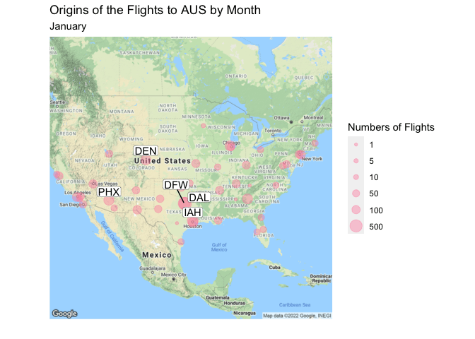
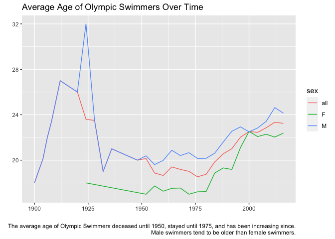
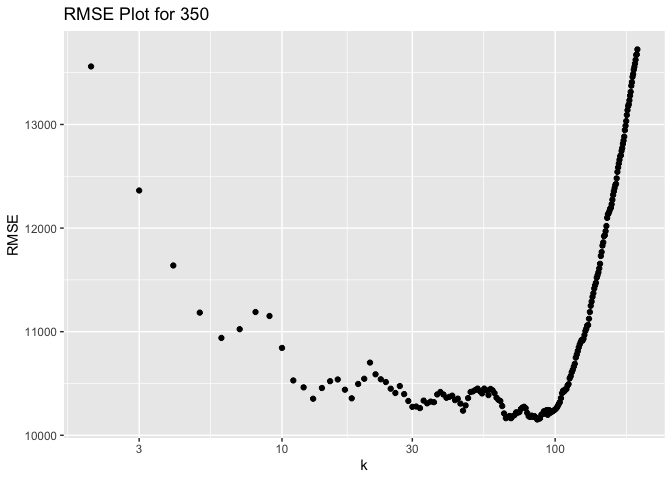
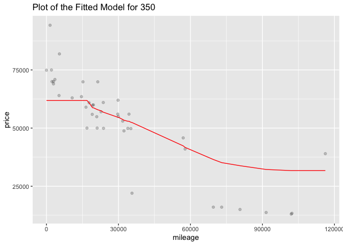
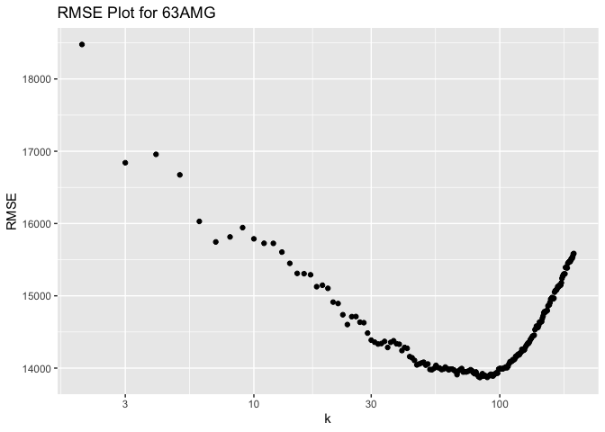
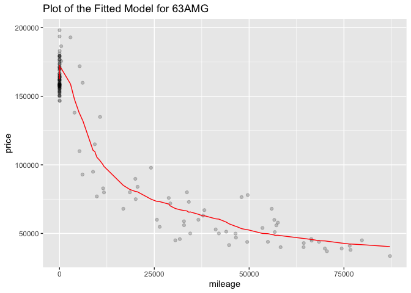

## 1) Data visualization: flights at ABIA

## 2) Wrangling the Billboard Top 100

Part A: Table of the top 10 most popular songs since 1958

| Song                                | Performer                                 | Count |
|:------------------------------------|:------------------------------------------|------:|
| Radioactive                         | Imagine Dragons                           |    87 |
| Sail                                | AWOLNATION                                |    79 |
| Blinding Lights                     | The Weeknd                                |    76 |
| I’m Yours                           | Jason Mraz                                |    76 |
| How Do I Live                       | LeAnn Rimes                               |    69 |
| Counting Stars                      | OneRepublic                               |    68 |
| Party Rock Anthem                   | LMFAO Featuring Lauren Bennett & GoonRock |    68 |
| Foolish Games/You Were Meant For Me | Jewel                                     |    65 |
| Rolling In The Deep                 | Adele                                     |    65 |
| Before He Cheats                    | Carrie Underwood                          |    64 |

Part B: Musical Diversity in Billboard Top 100

Part C: 30 Ten-Week Hits or more

## 3) Wrangling the Olympics

part A

The 95th percentile of heights for female competitors across all
Athletics events is 183.

part B

Rowing Women’s Coxed Fours has had the greatest variability in
competitor’s heights across the entire history of the Olympics.

Part C

## 4) K-nearest neighbors

### 350

The optimal value of k in this case is 68.

### 63 AMG

The optimal value of k in this case is 106.

63 AMG yields a larger optimal value of k. I suspect that it might be
because there are a lot of 63 AMGs with very low mileage.
