# 1) Data visualization: flights at ABIA

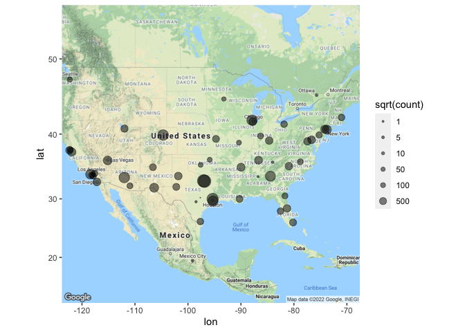

# 2) Wrangling the Billboard Top 100

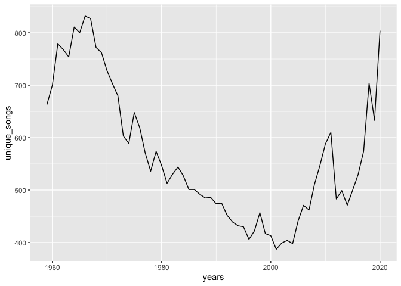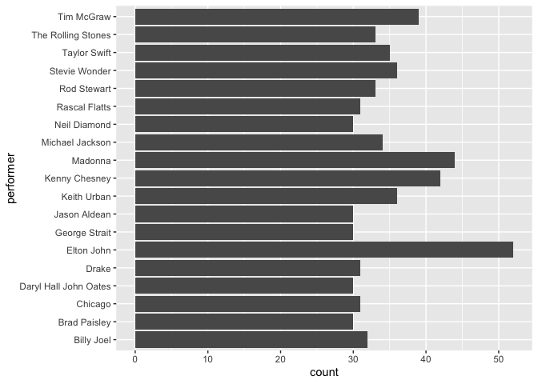

# 3) Wrangling the Olympics

    ## [1] 10.86549

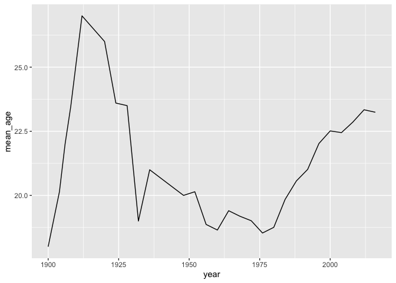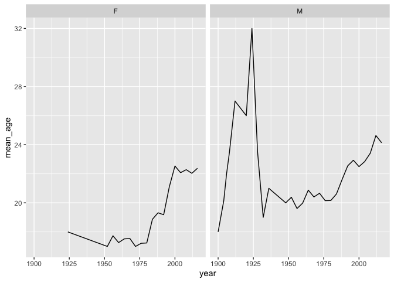

# 4) K-nearest neighbors

## 350

    ##        id            trim             subTrim           condition        
    ##  Min.   :  282   Length:416         Length:416         Length:416        
    ##  1st Qu.:14290   Class :character   Class :character   Class :character  
    ##  Median :26658   Mode  :character   Mode  :character   Mode  :character  
    ##  Mean   :26520                                                           
    ##  3rd Qu.:39599                                                           
    ##  Max.   :52220                                                           
    ##  isOneOwner         mileage            year         color          
    ##  Mode :logical   Min.   :     6   Min.   :1994   Length:416        
    ##  FALSE:310       1st Qu.: 19264   1st Qu.:2006   Class :character  
    ##  TRUE :106       Median : 29998   Median :2012   Mode  :character  
    ##                  Mean   : 42926   Mean   :2010                     
    ##                  3rd Qu.: 63479   3rd Qu.:2012                     
    ##                  Max.   :173000   Max.   :2013                     
    ##  displacement           fuel              state              region         
    ##  Length:416         Length:416         Length:416         Length:416        
    ##  Class :character   Class :character   Class :character   Class :character  
    ##  Mode  :character   Mode  :character   Mode  :character   Mode  :character  
    ##                                                                             
    ##                                                                             
    ##                                                                             
    ##  soundSystem         wheelType          wheelSize          featureCount   
    ##  Length:416         Length:416         Length:416         Min.   :  0.00  
    ##  Class :character   Class :character   Class :character   1st Qu.: 31.75  
    ##  Mode  :character   Mode  :character   Mode  :character   Median : 54.00  
    ##                                                           Mean   : 49.22  
    ##                                                           3rd Qu.: 70.00  
    ##                                                           Max.   :112.00  
    ##      price       
    ##  Min.   :  6600  
    ##  1st Qu.: 19401  
    ##  Median : 52900  
    ##  Mean   : 46854  
    ##  3rd Qu.: 61991  
    ##  Max.   :106010

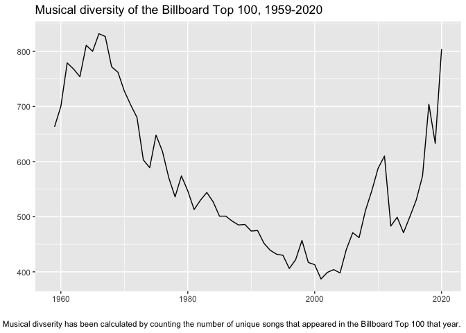

    ##          k       err
    ## result.1 2 10341.082
    ## result.2 3 10100.329
    ## result.3 4  9851.254
    ## result.4 5  9869.512
    ## result.5 6 10214.415
    ## result.6 7 10143.056

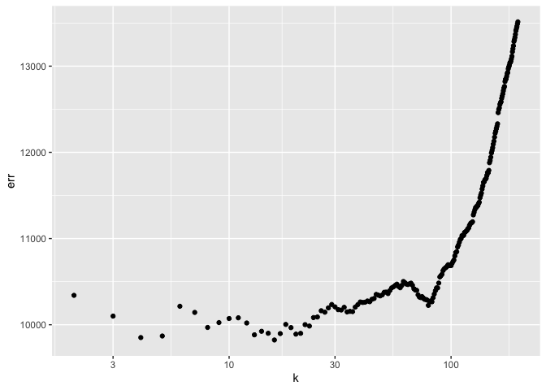

    ## [1] 16

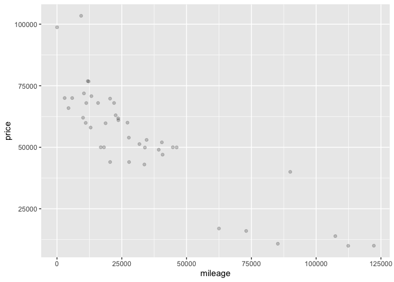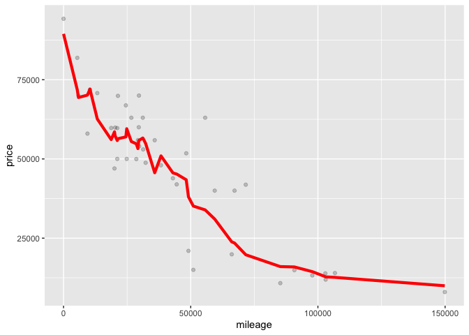

## 65 AMG

    ##        id            trim             subTrim           condition        
    ##  Min.   :  172   Length:1413        Length:1413        Length:1413       
    ##  1st Qu.:12809   Class :character   Class :character   Class :character  
    ##  Median :25863   Mode  :character   Mode  :character   Mode  :character  
    ##  Mean   :26087                                                           
    ##  3rd Qu.:38679                                                           
    ##  Max.   :52323                                                           
    ##  isOneOwner         mileage            year         color          
    ##  Mode :logical   Min.   :     1   Min.   :2008   Length:1413       
    ##  FALSE:1247      1st Qu.:    12   1st Qu.:2010   Class :character  
    ##  TRUE :166       Median :    60   Median :2014   Mode  :character  
    ##                  Mean   : 19354   Mean   :2013                     
    ##                  3rd Qu.: 36083   3rd Qu.:2015                     
    ##                  Max.   :147851   Max.   :2015                     
    ##  displacement           fuel              state              region         
    ##  Length:1413        Length:1413        Length:1413        Length:1413       
    ##  Class :character   Class :character   Class :character   Class :character  
    ##  Mode  :character   Mode  :character   Mode  :character   Mode  :character  
    ##                                                                             
    ##                                                                             
    ##                                                                             
    ##  soundSystem         wheelType          wheelSize          featureCount   
    ##  Length:1413        Length:1413        Length:1413        Min.   :  0.00  
    ##  Class :character   Class :character   Class :character   1st Qu.: 14.00  
    ##  Mode  :character   Mode  :character   Mode  :character   Median : 57.00  
    ##                                                           Mean   : 47.48  
    ##                                                           3rd Qu.: 75.00  
    ##                                                           Max.   :119.00  
    ##      price       
    ##  Min.   : 23990  
    ##  1st Qu.: 62995  
    ##  Median :150735  
    ##  Mean   :119549  
    ##  3rd Qu.:163055  
    ##  Max.   :251025

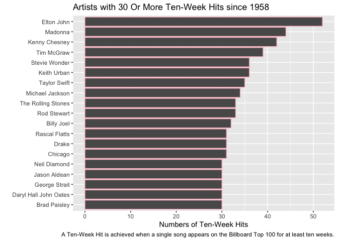

    ##           k      err
    ## result.1  2 18233.82
    ## result.2  4 18651.43
    ## result.3  6 17493.98
    ## result.4  8 16852.78
    ## result.5 10 16645.52
    ## result.6 15 16288.17

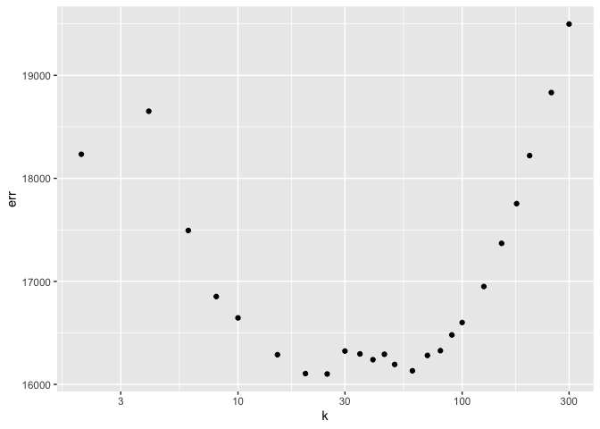

    ## [1] 25

