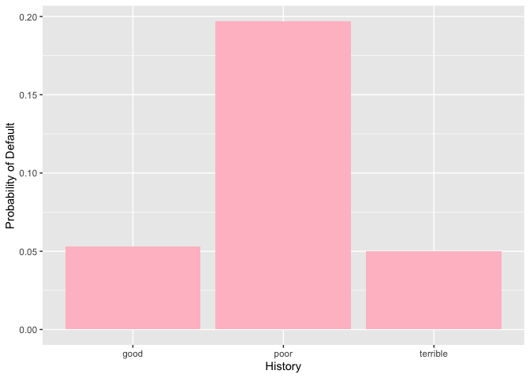
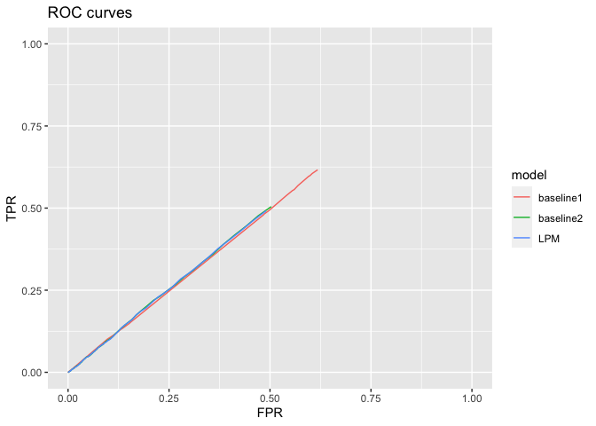
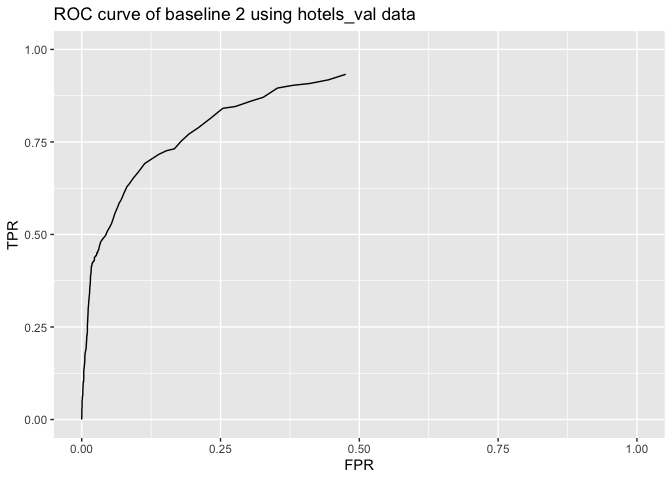

## 1) Data visualization

## 2) Saratoga house prices

The linear model seems to do better at achieving lower out-of sample
mean-squared error. It is also beneficial to use this model as we can
distinguish which variables have significant effects on the house
prices. The Lot Size, Land Value, Living Area, Waterfront and Central
Air Conditioning have significant effects on the house prices. All of
them are positively correlated with the house prices.

### Appendix of Q2

|              | k   |     rMSE |
|:-------------|:----|---------:|
| KNN Model    | 11  | 62665.91 |
| Linear Model | NA  | 59059.56 |

    ## 
    ## Call:
    ## lm(formula = price ~ . - pctCollege - sewer - newConstruction + 
    ##     rooms:bathrooms, data = .)
    ## 
    ## Residuals:
    ##     Min      1Q  Median      3Q     Max 
    ## -223108  -34705   -4185   28413  453701 
    ## 
    ## Coefficients:
    ##                          Estimate Std. Error t value Pr(>|t|)    
    ## (Intercept)             1.782e+05  2.443e+04   7.293 5.10e-13 ***
    ## lotSize                 9.131e+03  2.266e+03   4.029 5.90e-05 ***
    ## age                    -3.295e+01  6.491e+01  -0.508  0.61174    
    ## landValue               9.039e-01  5.348e-02  16.900  < 2e-16 ***
    ## livingArea              6.289e+01  5.371e+00  11.710  < 2e-16 ***
    ## bedrooms               -7.081e+03  2.931e+03  -2.416  0.01581 *  
    ## fireplaces              2.058e+03  3.403e+03   0.605  0.54554    
    ## bathrooms               5.259e+03  8.499e+03   0.619  0.53613    
    ## rooms                  -1.852e+03  2.313e+03  -0.801  0.42335    
    ## heatinghot water/steam -7.085e+03  4.713e+03  -1.503  0.13300    
    ## heatingelectric        -1.331e+03  1.285e+04  -0.104  0.91750    
    ## fuelelectric           -9.419e+03  1.259e+04  -0.748  0.45465    
    ## fueloil                -4.768e+03  5.407e+03  -0.882  0.37807    
    ## waterfrontNo           -1.126e+05  1.751e+04  -6.432 1.73e-10 ***
    ## centralAirNo           -1.170e+04  3.865e+03  -3.028  0.00251 ** 
    ## bathrooms:rooms         2.525e+03  1.071e+03   2.358  0.01853 *  
    ## ---
    ## Signif. codes:  0 '***' 0.001 '**' 0.01 '*' 0.05 '.' 0.1 ' ' 1
    ## 
    ## Residual standard error: 58940 on 1366 degrees of freedom
    ## Multiple R-squared:  0.6481, Adjusted R-squared:  0.6442 
    ## F-statistic: 167.7 on 15 and 1366 DF,  p-value: < 2.2e-16

Choose k = 11 as it has the smallest mean RMSE over 5 folds.  
Standard error is smaller for the linear model.

## 3) Classification and retrospective sampling

    ##         (Intercept)            duration              amount         installment 
    ##                0.62                1.02                1.00                1.24 
    ##                 age         historypoor     historyterrible          purposeedu 
    ##                0.98                0.34                0.16                1.93 
    ## purposegoods/repair       purposenewcar      purposeusedcar       foreigngerman 
    ##                0.92                1.92                0.23                0.42

| history  | count |
|:---------|------:|
| good     |    89 |
| poor     |   618 |
| terrible |   293 |
| total    |  1000 |

In this logistic regression model, having the `historypoor` variable 1
multiplies odds of default by 0.39 and having the `historyterrible`
variable 1 multiplies odds of default by 0.19. This means that having
poor or terrible credit actually decreases the probability of default.
This does not reconcile with the common sense; we think the dataset is
not appropriate for building a predictive model of defaults especially
if the purpose of the model is to screen prospective borrowers to
classify them into “high” versus “low” probability of default. It is
because of the data sampling process. In the data sampling process,
instead of random sampling, the bank picked the defaulted loans and
looked for similar kinds of loans. This likely created a big bias in the
data collecting process: as mentioned above, in common sense, it is
likely that the credit history for defaulted loans are poor or terrible
and it would not include enough dataset with good credit history. In
fact, out of 1000 observations, only 89 observaations have good credit
history. I would suggest the bank to use random sampling method even
though it would not include a lot of defaulted loans. If possible,
increasing the size of the observations will help tremendously.

## 4) Children and hotel reservations

### Model Building

|              | Out-of-Sample RMSE |
|:-------------|-------------------:|
| Baseline 1   |          3.1199718 |
| Baseline 2   |          0.2332819 |
| Linear Model |          0.2330376 |

Baseline 2 and Linear Model have similar RMSEs. They both perform much
better than the baseline 1 model. RMSEs were calculated with 5-fold
cross validations.

The ROC curves are also better for baseline 2 and the linear model than
that of baseline 1. The two look similar to each other.

| model     |       TPR |       FPR |
|:----------|----------:|----------:|
| baseline1 | 0.0000000 | 0.0000000 |
| baseline2 | 0.0412655 | 0.0408800 |
| LPM       | 0.0409904 | 0.0404448 |

This table has the TPR and FPR of the models when the threshold is set
at 0.5. We can see that the baseline 2 and LPM has higher TPRs.

### Model validation: step 1

### Model validation: step 2

|        | hotels_predicted | hotels_actual | hotels_difference |
|:-------|:-----------------|:--------------|:------------------|
| Fold01 | 21               | 19            | -2                |
| Fold02 | 22               | 21            | -1                |
| Fold03 | 23               | 17            | -6                |
| Fold04 | 25               | 27            | 2                 |
| Fold05 | 20               | 20            | 0                 |
| Fold06 | 21               | 25            | 4                 |
| Fold07 | 16               | 16            | 0                 |
| Fold08 | 14               | 15            | 1                 |
| Fold09 | 20               | 20            | 0                 |
| Fold10 | 20               | 19            | -1                |
| Fold11 | 20               | 19            | -1                |
| Fold12 | 18               | 20            | 2                 |
| Fold13 | 23               | 20            | -3                |
| Fold14 | 21               | 25            | 4                 |
| Fold15 | 23               | 26            | 3                 |
| Fold16 | 21               | 23            | 2                 |
| Fold17 | 20               | 17            | -3                |
| Fold18 | 19               | 13            | -6                |
| Fold19 | 27               | 23            | -4                |
| Fold20 | 17               | 17            | 0                 |
| total  | 411              | 402           | 9                 |

The model does the prediction pretty well. It only had 9 predictions
wrong in total out of 4999 observations.
