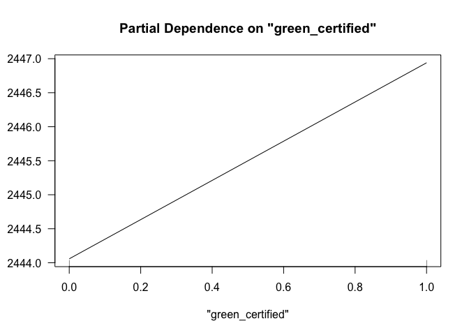
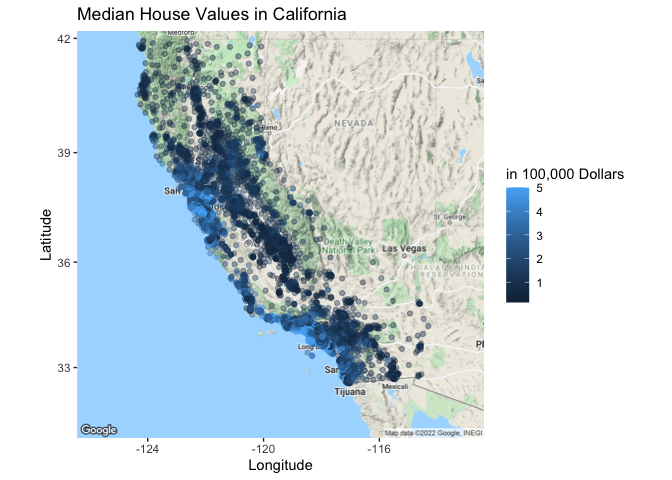
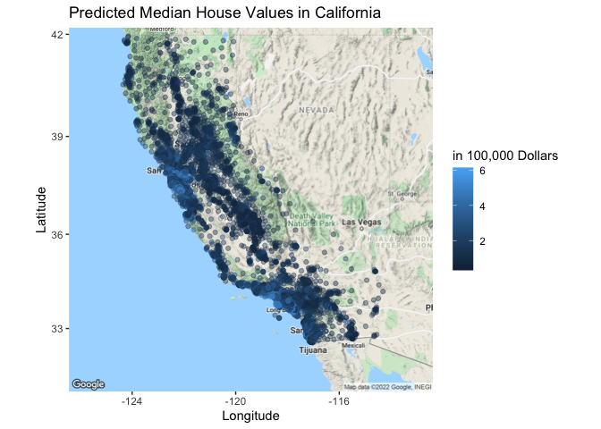

## What causes what?

1.  You can’t just get data from a few different cities and run the
    regressions of “Crime” on “Police” because cities have incentives to
    hire more cops when there is an increased number of crimes. Because
    of this, it would look like “Crime” is positively correlated to
    “Police” when there is no reason to believe there is a causal
    relationship.

How were the researchers from UPenn able to isolate this effect? Briefly
describe their approach and discuss their result in the “Table 2” below,
from the researchers’ paper.

1.  The researchers from UPenn were able to isolate this effect because
    the District of Columbia had the policy where they increased
    “Police” when there is an increased risk of terrorism, which is
    believed to be unrelated to the street crime rates. The result in
    the “Table 2” below says that there is a statistically significant
    negative relationship between the “High Alert” and “Crime”, implying
    that the increased number of cops because of the possible terrorist
    risk decreased the crime rates. This holds true even after
    controlling for the ridership of Metro.

2.  They had to control for Metro ridership because, if “Crime”
    decreased because there were less people on the streets, that would
    not neccesarily mean the rate of crime decreasing because of the
    increased number of cops. This would be of concern if people stayed
    home because of the terrorist alert. However, it did not turn out to
    be true. They were trying to capture the effect of the decrease of
    normal human activity in the city on the number of crime incidents.

3.  The model being estimated here is the effect of “High Alert”,
    controlled for “Midday Ridership”, by districts (if it is district 1
    or not). The conclusion is that the effect of “High Alert” is only
    significant in the first police district area.

## Tree modeling: dengue cases

|      |   Tree 1 |  Tree 2 |   Tree 3 |
|:-----|---------:|--------:|---------:|
| RMSE | 28.06073 | 27.8904 | 28.25697 |

First, I split the data into training and testing sets. Then, I wanted
to choose the best CART model. For CART, we choose the second model with
the specification of
`total_cases ~ season + specific_humidity + tdtr_k + precipitation_amt`
as it has the lowest in-sample cross validated rMSE. Then, I trained
again the chosen model with all the training data and pruned the tree.

|      | Random Forest 1 | Random Forest 2 | Random Forest 3 |
|:-----|----------------:|----------------:|----------------:|
| RMSE |        25.64166 |        25.65276 |        26.08037 |

For the random forest model, we choose the third model with the
specification of
`total_cases ~ city + season + specific_humidity + tdtr_k + precipitation_amt`
as it has the lowest in-sample cross validated rMSE. Then, I trained
again the chosen model with all the training data.

|      | Gradient Boosted Tree 1 | Gradient Boosted Tree 2 | Gradient Boosted Tree 3 |
|:-----|------------------------:|------------------------:|------------------------:|
| RMSE |                 26.5814 |                27.49868 |                27.09754 |

For the gradient boosted tree model, we again choose the third model
with the specification of
`total_cases ~ city + season + specific_humidity + tdtr_k + precipitation_amt`
as it has the lowest in-sample cross validated rMSE. Then, I trained
again the chosen model with all the training data.

|      |     CART |   Pruned | Ranbdom Forest |  Boosted |
|:-----|---------:|---------:|---------------:|---------:|
| RMSE | 30.09254 | 32.62713 |       29.34665 | 31.71879 |

Out-of-sample rMSE is lowest with the random forest model. We draw the
partial dependence plots below.

## Predictive model building: green certification

Modeling started with combining the LEED and EnergyStar to create a
green_certified column. Also removed the null variables. Created a train
test split with 80 percent of the data being the training set data and
20 percent being the testing set data.

In terms of the types of models we started with a linear regression
model. After that using the stepwise variable selection computed the
best set of variables and the interaction between them which performed
the best. That became the second model.

|      |   Tree 1 |   Tree 2 |   Tree 3 |
|:-----|---------:|---------:|---------:|
| RMSE | 1313.599 | 1504.235 | 1228.331 |

Next, experimented with a tree model by considering all the variables
except LEED, Energystar because LEED and Energystar is already
considered under the green_certified and including it would create
multicollinearity issues. We also adopted the pruning method to test
trees with different configurations which increased the performance of
the tree model. Constructed 2 more tree models with cross folds of 5
with the first one having all the variables and second one removing
leasing_rate and also Rent along with LEED and Energystar. The model
with all the variables performs the best during in sample performance.

|      | Random Forest 1 | Random Forest 2 | Random Forest 3 |
|:-----|----------------:|----------------:|----------------:|
| RMSE |        233.9297 |        733.6104 |        283.1389 |

Used the random forest models with all variables as the next model and
saw a significant improvment in the model performance. Out of the three
models that we used with cross validation the model which had all the
variables performed the best during in sample performance test.

|      |   Linear | Stepwise |     Tree | Pruned Tree |   Forest |      GBM |      knn |
|:-----|---------:|---------:|---------:|------------:|---------:|---------:|---------:|
| RMSE | 1089.988 | 1081.185 | 1613.272 |    371.3405 | 271.5545 | 958.0266 | 1502.351 |

Gradient Boosting model was selected next with distribution as
“gaussian”, the number of trees as 10000, shrinkage as 0.01,and with a
interaction depth of 4. Also added the cross validation option with a
value of 5. This model gave a similar performance compared to the best
random forest model. At last we chose a knn model and calculated a model
for each k value from 300 to 495 with a difference of 5. Found the best
k value which has the best performance.

In the end compared all these selected models with the rmse values and
this can be seen on the table above.

Since the random forest model performed the best, chose this model to
draw a partial plot with. As seen in the graph above a green_certified
building generates 3 dollars more in revenue on average compared to a
non green_certified building per square foot per year.

## Predictive model building: California housing

    ## Start:  AIC=370803
    ## medianHouseValue ~ (longitude + latitude + housingMedianAge + 
    ##     totalRooms + totalBedrooms + population + households + medianIncome) - 
    ##     longitude - latitude
    ## 
    ##                                  Df  Sum of Sq        RSS    AIC
    ## + totalBedrooms:medianIncome      1 2.6245e+12 9.0743e+13 370334
    ## + households:medianIncome         1 2.5607e+12 9.0807e+13 370346
    ## + totalRooms:medianIncome         1 2.1970e+12 9.1171e+13 370412
    ## + population:medianIncome         1 1.3784e+12 9.1990e+13 370559
    ## + housingMedianAge:totalBedrooms  1 8.3510e+11 9.2533e+13 370657
    ## + housingMedianAge:households     1 7.9832e+11 9.2570e+13 370663
    ## + totalBedrooms:households        1 3.0953e+11 9.3058e+13 370750
    ## + housingMedianAge:totalRooms     1 2.3089e+11 9.3137e+13 370764
    ## + totalRooms:population           1 4.6636e+10 9.3321e+13 370797
    ## + totalRooms:totalBedrooms        1 4.1638e+10 9.3326e+13 370798
    ## + totalRooms:households           1 2.3242e+10 9.3345e+13 370801
    ## + housingMedianAge:population     1 1.4442e+10 9.3353e+13 370802
    ## <none>                                         9.3368e+13 370803
    ## + housingMedianAge:medianIncome   1 7.7710e+09 9.3360e+13 370804
    ## + totalBedrooms:population        1 3.5596e+09 9.3364e+13 370804
    ## + population:households           1 8.5325e+08 9.3367e+13 370805
    ## - totalBedrooms                   1 8.0291e+11 9.4171e+13 370942
    ## - households                      1 1.3531e+12 9.4721e+13 371039
    ## - totalRooms                      1 2.6218e+12 9.5990e+13 371258
    ## - population                      1 4.6439e+12 9.8012e+13 371602
    ## - housingMedianAge                1 7.5834e+12 1.0095e+14 372090
    ## - medianIncome                    1 8.9062e+13 1.8243e+14 381861
    ## 
    ## Step:  AIC=370334.2
    ## medianHouseValue ~ housingMedianAge + totalRooms + totalBedrooms + 
    ##     population + households + medianIncome + totalBedrooms:medianIncome
    ## 
    ##                                  Df  Sum of Sq        RSS    AIC
    ## + housingMedianAge:totalBedrooms  1 1.0891e+12 8.9654e+13 370137
    ## + housingMedianAge:households     1 1.0623e+12 8.9681e+13 370142
    ## + housingMedianAge:totalRooms     1 5.3928e+11 9.0204e+13 370238
    ## + totalBedrooms:households        1 4.6888e+11 9.0275e+13 370251
    ## + totalRooms:totalBedrooms        1 1.6485e+11 9.0579e+13 370306
    ## + totalRooms:households           1 1.4277e+11 9.0601e+13 370310
    ## + population:medianIncome         1 1.1490e+11 9.0628e+13 370315
    ## + housingMedianAge:medianIncome   1 8.5888e+10 9.0658e+13 370321
    ## + housingMedianAge:population     1 4.3919e+10 9.0699e+13 370328
    ## + households:medianIncome         1 1.5854e+10 9.0728e+13 370333
    ## <none>                                         9.0743e+13 370334
    ## + totalRooms:population           1 7.9786e+09 9.0735e+13 370335
    ## + totalRooms:medianIncome         1 6.1272e+09 9.0737e+13 370335
    ## + totalBedrooms:population        1 5.9518e+09 9.0737e+13 370335
    ## + population:households           1 3.2266e+09 9.0740e+13 370336
    ## - households                      1 9.0582e+11 9.1649e+13 370496
    ## - totalBedrooms:medianIncome      1 2.6245e+12 9.3368e+13 370803
    ## - population                      1 3.6506e+12 9.4394e+13 370983
    ## - totalRooms                      1 5.2084e+12 9.5952e+13 371254
    ## - housingMedianAge                1 7.0291e+12 9.7773e+13 371564
    ## 
    ## Step:  AIC=370136.8
    ## medianHouseValue ~ housingMedianAge + totalRooms + totalBedrooms + 
    ##     population + households + medianIncome + totalBedrooms:medianIncome + 
    ##     housingMedianAge:totalBedrooms
    ## 
    ##                                  Df  Sum of Sq        RSS    AIC
    ## + housingMedianAge:population     1 1.8720e+12 8.7782e+13 369790
    ## + totalRooms:population           1 3.3240e+11 8.9322e+13 370077
    ## + housingMedianAge:totalRooms     1 2.9469e+11 8.9360e+13 370084
    ## + totalBedrooms:population        1 1.6043e+11 8.9494e+13 370109
    ## + population:households           1 1.5687e+11 8.9497e+13 370110
    ## + housingMedianAge:medianIncome   1 1.5029e+11 8.9504e+13 370111
    ## + population:medianIncome         1 1.3405e+11 8.9520e+13 370114
    ## + totalBedrooms:households        1 4.8974e+10 8.9605e+13 370130
    ## + totalRooms:households           1 1.8179e+10 8.9636e+13 370135
    ## + totalRooms:totalBedrooms        1 1.4586e+10 8.9640e+13 370136
    ## <none>                                         8.9654e+13 370137
    ## + totalRooms:medianIncome         1 3.6720e+09 8.9651e+13 370138
    ## + households:medianIncome         1 1.9443e+09 8.9652e+13 370138
    ## + housingMedianAge:households     1 5.5676e+08 8.9654e+13 370139
    ## - households                      1 6.0539e+11 9.0260e+13 370246
    ## - housingMedianAge:totalBedrooms  1 1.0891e+12 9.0743e+13 370334
    ## - totalBedrooms:medianIncome      1 2.8786e+12 9.2533e+13 370657
    ## - population                      1 3.4588e+12 9.3113e+13 370760
    ## - totalRooms                      1 3.7752e+12 9.3430e+13 370816
    ## 
    ## Step:  AIC=369790.3
    ## medianHouseValue ~ housingMedianAge + totalRooms + totalBedrooms + 
    ##     population + households + medianIncome + totalBedrooms:medianIncome + 
    ##     housingMedianAge:totalBedrooms + housingMedianAge:population
    ## 
    ##                                  Df  Sum of Sq        RSS    AIC
    ## + housingMedianAge:households     1 4.4145e+11 8.7341e+13 369709
    ## + population:medianIncome         1 2.1972e+11 8.7563e+13 369751
    ## + totalBedrooms:households        1 1.7465e+11 8.7608e+13 369759
    ## + housingMedianAge:medianIncome   1 1.6658e+11 8.7616e+13 369761
    ## + housingMedianAge:totalRooms     1 4.3811e+10 8.7738e+13 369784
    ## + totalRooms:population           1 3.6860e+10 8.7745e+13 369785
    ## + totalRooms:medianIncome         1 1.8733e+10 8.7764e+13 369789
    ## <none>                                         8.7782e+13 369790
    ## + totalRooms:households           1 9.9330e+09 8.7772e+13 369790
    ## + households:medianIncome         1 9.4453e+09 8.7773e+13 369791
    ## + totalRooms:totalBedrooms        1 2.6044e+09 8.7780e+13 369792
    ## + totalBedrooms:population        1 1.3292e+09 8.7781e+13 369792
    ## + population:households           1 1.9347e+08 8.7782e+13 369792
    ## - households                      1 1.5395e+11 8.7936e+13 369817
    ## - housingMedianAge:population     1 1.8720e+12 8.9654e+13 370137
    ## - housingMedianAge:totalBedrooms  1 2.9172e+12 9.0699e+13 370328
    ## - totalBedrooms:medianIncome      1 2.9931e+12 9.0775e+13 370342
    ## - totalRooms                      1 4.4986e+12 9.2281e+13 370614
    ## 
    ## Step:  AIC=369709.1
    ## medianHouseValue ~ housingMedianAge + totalRooms + totalBedrooms + 
    ##     population + households + medianIncome + totalBedrooms:medianIncome + 
    ##     housingMedianAge:totalBedrooms + housingMedianAge:population + 
    ##     housingMedianAge:households
    ## 
    ##                                  Df  Sum of Sq        RSS    AIC
    ## + totalBedrooms:households        1 1.5917e+11 8.7182e+13 369681
    ## + population:medianIncome         1 1.3848e+11 8.7202e+13 369685
    ## + housingMedianAge:medianIncome   1 1.3261e+11 8.7208e+13 369686
    ## + housingMedianAge:totalRooms     1 4.1876e+10 8.7299e+13 369703
    ## + totalRooms:population           1 3.6131e+10 8.7305e+13 369704
    ## - housingMedianAge:totalBedrooms  1 1.8661e+08 8.7341e+13 369707
    ## + totalRooms:medianIncome         1 1.1057e+10 8.7330e+13 369709
    ## <none>                                         8.7341e+13 369709
    ## + totalRooms:totalBedrooms        1 6.9423e+09 8.7334e+13 369710
    ## + totalRooms:households           1 5.8751e+09 8.7335e+13 369710
    ## + households:medianIncome         1 5.3030e+09 8.7335e+13 369710
    ## + totalBedrooms:population        1 8.4203e+08 8.7340e+13 369711
    ## + population:households           1 6.4890e+08 8.7340e+13 369711
    ## - housingMedianAge:households     1 4.4145e+11 8.7782e+13 369790
    ## - housingMedianAge:population     1 2.3129e+12 8.9654e+13 370139
    ## - totalBedrooms:medianIncome      1 3.0938e+12 9.0435e+13 370282
    ## - totalRooms                      1 4.7473e+12 9.2088e+13 370581
    ## 
    ## Step:  AIC=369681
    ## medianHouseValue ~ housingMedianAge + totalRooms + totalBedrooms + 
    ##     population + households + medianIncome + totalBedrooms:medianIncome + 
    ##     housingMedianAge:totalBedrooms + housingMedianAge:population + 
    ##     housingMedianAge:households + totalBedrooms:households
    ## 
    ##                                  Df  Sum of Sq        RSS    AIC
    ## + totalRooms:population           1 1.3081e+12 8.5874e+13 369433
    ## + totalRooms:households           1 1.0994e+12 8.6082e+13 369473
    ## + totalBedrooms:population        1 1.0272e+12 8.6154e+13 369487
    ## + population:households           1 8.7764e+11 8.6304e+13 369516
    ## + totalRooms:totalBedrooms        1 8.3176e+11 8.6350e+13 369525
    ## + population:medianIncome         1 1.4930e+11 8.7032e+13 369655
    ## + housingMedianAge:medianIncome   1 1.2924e+11 8.7052e+13 369658
    ## + housingMedianAge:totalRooms     1 6.4790e+10 8.7117e+13 369671
    ## - housingMedianAge:totalBedrooms  1 5.7380e+08 8.7182e+13 369679
    ## + totalRooms:medianIncome         1 1.1532e+10 8.7170e+13 369681
    ## <none>                                         8.7182e+13 369681
    ## + households:medianIncome         1 5.3263e+09 8.7176e+13 369682
    ## - totalBedrooms:households        1 1.5917e+11 8.7341e+13 369709
    ## - housingMedianAge:households     1 4.2598e+11 8.7608e+13 369759
    ## - housingMedianAge:population     1 2.4237e+12 8.9605e+13 370132
    ## - totalBedrooms:medianIncome      1 3.1559e+12 9.0337e+13 370266
    ## - totalRooms                      1 4.8431e+12 9.2025e+13 370572
    ## 
    ## Step:  AIC=369433.3
    ## medianHouseValue ~ housingMedianAge + totalRooms + totalBedrooms + 
    ##     population + households + medianIncome + totalBedrooms:medianIncome + 
    ##     housingMedianAge:totalBedrooms + housingMedianAge:population + 
    ##     housingMedianAge:households + totalBedrooms:households + 
    ##     totalRooms:population
    ## 
    ##                                  Df  Sum of Sq        RSS    AIC
    ## + population:medianIncome         1 1.8445e+11 8.5689e+13 369400
    ## + housingMedianAge:medianIncome   1 9.3827e+10 8.5780e+13 369417
    ## + totalRooms:households           1 8.8245e+10 8.5785e+13 369418
    ## + totalRooms:totalBedrooms        1 8.6940e+10 8.5787e+13 369419
    ## + totalRooms:medianIncome         1 5.9481e+10 8.5814e+13 369424
    ## + housingMedianAge:totalRooms     1 1.5623e+10 8.5858e+13 369432
    ## - housingMedianAge:totalBedrooms  1 7.5261e+09 8.5881e+13 369433
    ## <none>                                         8.5874e+13 369433
    ## + population:households           1 2.4109e+09 8.5871e+13 369435
    ## + totalBedrooms:population        1 1.4588e+09 8.5872e+13 369435
    ## + households:medianIncome         1 9.7762e+08 8.5873e+13 369435
    ## - housingMedianAge:households     1 3.4048e+11 8.6214e+13 369497
    ## - housingMedianAge:population     1 1.1714e+12 8.7045e+13 369655
    ## - totalRooms:population           1 1.3081e+12 8.7182e+13 369681
    ## - totalBedrooms:households        1 1.4311e+12 8.7305e+13 369704
    ## - totalBedrooms:medianIncome      1 3.0120e+12 8.8886e+13 370001
    ## 
    ## Step:  AIC=369399.8
    ## medianHouseValue ~ housingMedianAge + totalRooms + totalBedrooms + 
    ##     population + households + medianIncome + totalBedrooms:medianIncome + 
    ##     housingMedianAge:totalBedrooms + housingMedianAge:population + 
    ##     housingMedianAge:households + totalBedrooms:households + 
    ##     totalRooms:population + population:medianIncome
    ## 
    ##                                  Df  Sum of Sq        RSS    AIC
    ## + totalRooms:households           1 1.2709e+11 8.5562e+13 369377
    ## + totalRooms:totalBedrooms        1 1.0331e+11 8.5586e+13 369382
    ## + households:medianIncome         1 8.6651e+10 8.5602e+13 369385
    ## + housingMedianAge:medianIncome   1 8.1537e+10 8.5608e+13 369386
    ## + housingMedianAge:totalRooms     1 3.4163e+10 8.5655e+13 369395
    ## + population:households           1 2.6462e+10 8.5663e+13 369397
    ## - housingMedianAge:totalBedrooms  1 2.0287e+08 8.5689e+13 369398
    ## + totalRooms:medianIncome         1 1.5198e+10 8.5674e+13 369399
    ## + totalBedrooms:population        1 1.1188e+10 8.5678e+13 369400
    ## <none>                                         8.5689e+13 369400
    ## - population:medianIncome         1 1.8445e+11 8.5874e+13 369433
    ## - housingMedianAge:households     1 2.6003e+11 8.5949e+13 369448
    ## - housingMedianAge:population     1 1.1659e+12 8.6855e+13 369621
    ## - totalRooms:population           1 1.3432e+12 8.7032e+13 369655
    ## - totalBedrooms:households        1 1.4790e+12 8.7168e+13 369680
    ## - totalBedrooms:medianIncome      1 1.6925e+12 8.7382e+13 369721
    ## 
    ## Step:  AIC=369377.3
    ## medianHouseValue ~ housingMedianAge + totalRooms + totalBedrooms + 
    ##     population + households + medianIncome + totalBedrooms:medianIncome + 
    ##     housingMedianAge:totalBedrooms + housingMedianAge:population + 
    ##     housingMedianAge:households + totalBedrooms:households + 
    ##     totalRooms:population + population:medianIncome + totalRooms:households
    ## 
    ##                                  Df  Sum of Sq        RSS    AIC
    ## + totalBedrooms:population        1 1.7429e+11 8.5388e+13 369346
    ## + households:medianIncome         1 8.4735e+10 8.5477e+13 369363
    ## + housingMedianAge:medianIncome   1 6.8113e+10 8.5494e+13 369366
    ## + population:households           1 5.0456e+10 8.5512e+13 369370
    ## - housingMedianAge:totalBedrooms  1 3.4517e+07 8.5562e+13 369375
    ## + totalRooms:medianIncome         1 1.5603e+10 8.5546e+13 369376
    ## + housingMedianAge:totalRooms     1 1.1911e+10 8.5550e+13 369377
    ## <none>                                         8.5562e+13 369377
    ## + totalRooms:totalBedrooms        1 3.0387e+09 8.5559e+13 369379
    ## - totalRooms:households           1 1.2709e+11 8.5689e+13 369400
    ## - population:medianIncome         1 2.2330e+11 8.5785e+13 369418
    ## - totalRooms:population           1 2.5908e+11 8.5821e+13 369425
    ## - housingMedianAge:households     1 2.8878e+11 8.5851e+13 369431
    ## - totalBedrooms:households        1 1.0126e+12 8.6575e+13 369570
    ## - housingMedianAge:population     1 1.2814e+12 8.6843e+13 369621
    ## - totalBedrooms:medianIncome      1 1.6229e+12 8.7185e+13 369686
    ## 
    ## Step:  AIC=369345.7
    ## medianHouseValue ~ housingMedianAge + totalRooms + totalBedrooms + 
    ##     population + households + medianIncome + totalBedrooms:medianIncome + 
    ##     housingMedianAge:totalBedrooms + housingMedianAge:population + 
    ##     housingMedianAge:households + totalBedrooms:households + 
    ##     totalRooms:population + population:medianIncome + totalRooms:households + 
    ##     totalBedrooms:population
    ## 
    ##                                  Df  Sum of Sq        RSS    AIC
    ## + housingMedianAge:medianIncome   1 6.7113e+10 8.5321e+13 369335
    ## + households:medianIncome         1 6.0222e+10 8.5327e+13 369336
    ## + housingMedianAge:totalRooms     1 2.8748e+10 8.5359e+13 369342
    ## - housingMedianAge:totalBedrooms  1 1.5928e+07 8.5388e+13 369344
    ## + totalRooms:medianIncome         1 1.3843e+10 8.5374e+13 369345
    ## + population:households           1 1.1454e+10 8.5376e+13 369345
    ## <none>                                         8.5388e+13 369346
    ## + totalRooms:totalBedrooms        1 1.6385e+09 8.5386e+13 369347
    ## - population:medianIncome         1 6.6327e+10 8.5454e+13 369356
    ## - totalRooms:population           1 7.6663e+10 8.5464e+13 369358
    ## - totalBedrooms:population        1 1.7429e+11 8.5562e+13 369377
    ## - totalRooms:households           1 2.9019e+11 8.5678e+13 369400
    ## - housingMedianAge:households     1 3.1575e+11 8.5703e+13 369405
    ## - totalBedrooms:households        1 6.1300e+11 8.6001e+13 369462
    ## - totalBedrooms:medianIncome      1 1.2905e+12 8.6678e+13 369591
    ## - housingMedianAge:population     1 1.3828e+12 8.6770e+13 369609
    ## 
    ## Step:  AIC=369334.7
    ## medianHouseValue ~ housingMedianAge + totalRooms + totalBedrooms + 
    ##     population + households + medianIncome + totalBedrooms:medianIncome + 
    ##     housingMedianAge:totalBedrooms + housingMedianAge:population + 
    ##     housingMedianAge:households + totalBedrooms:households + 
    ##     totalRooms:population + population:medianIncome + totalRooms:households + 
    ##     totalBedrooms:population + housingMedianAge:medianIncome
    ## 
    ##                                  Df  Sum of Sq        RSS    AIC
    ## + housingMedianAge:totalRooms     1 1.3551e+11 8.5185e+13 369310
    ## + households:medianIncome         1 4.7992e+10 8.5273e+13 369327
    ## - housingMedianAge:totalBedrooms  1 2.4458e+08 8.5321e+13 369333
    ## + population:households           1 1.6453e+10 8.5304e+13 369334
    ## <none>                                         8.5321e+13 369335
    ## + totalRooms:medianIncome         1 9.6828e+09 8.5311e+13 369335
    ## + totalRooms:totalBedrooms        1 4.2276e+09 8.5316e+13 369336
    ## - population:medianIncome         1 5.9529e+10 8.5380e+13 369344
    ## - housingMedianAge:medianIncome   1 6.7113e+10 8.5388e+13 369346
    ## - totalRooms:population           1 7.5299e+10 8.5396e+13 369347
    ## - totalBedrooms:population        1 1.7329e+11 8.5494e+13 369366
    ## - totalRooms:households           1 2.7904e+11 8.5600e+13 369387
    ## - housingMedianAge:households     1 2.9681e+11 8.5617e+13 369390
    ## - totalBedrooms:households        1 5.9657e+11 8.5917e+13 369448
    ## - totalBedrooms:medianIncome      1 1.3344e+12 8.6655e+13 369589
    ## - housingMedianAge:population     1 1.3730e+12 8.6694e+13 369596
    ## 
    ## Step:  AIC=369310.4
    ## medianHouseValue ~ housingMedianAge + totalRooms + totalBedrooms + 
    ##     population + households + medianIncome + totalBedrooms:medianIncome + 
    ##     housingMedianAge:totalBedrooms + housingMedianAge:population + 
    ##     housingMedianAge:households + totalBedrooms:households + 
    ##     totalRooms:population + population:medianIncome + totalRooms:households + 
    ##     totalBedrooms:population + housingMedianAge:medianIncome + 
    ##     housingMedianAge:totalRooms
    ## 
    ##                                  Df  Sum of Sq        RSS    AIC
    ## + households:medianIncome         1 7.9711e+10 8.5105e+13 369297
    ## + totalRooms:medianIncome         1 3.2996e+10 8.5152e+13 369306
    ## <none>                                         8.5185e+13 369310
    ## + population:households           1 7.5682e+09 8.5177e+13 369311
    ## + totalRooms:totalBedrooms        1 1.2663e+09 8.5184e+13 369312
    ## - housingMedianAge:totalBedrooms  1 3.2182e+10 8.5217e+13 369315
    ## - population:medianIncome         1 6.2552e+10 8.5248e+13 369321
    ## - totalRooms:population           1 1.0209e+11 8.5287e+13 369328
    ## - housingMedianAge:totalRooms     1 1.3551e+11 8.5321e+13 369335
    ## - housingMedianAge:medianIncome   1 1.7387e+11 8.5359e+13 369342
    ## - totalBedrooms:population        1 2.2177e+11 8.5407e+13 369351
    ## - housingMedianAge:households     1 2.6305e+11 8.5448e+13 369359
    ## - totalRooms:households           1 2.7493e+11 8.5460e+13 369362
    ## - totalBedrooms:households        1 6.1473e+11 8.5800e+13 369427
    ## - housingMedianAge:population     1 1.0907e+12 8.6276e+13 369519
    ## - totalBedrooms:medianIncome      1 1.3659e+12 8.6551e+13 369571
    ## 
    ## Step:  AIC=369297
    ## medianHouseValue ~ housingMedianAge + totalRooms + totalBedrooms + 
    ##     population + households + medianIncome + totalBedrooms:medianIncome + 
    ##     housingMedianAge:totalBedrooms + housingMedianAge:population + 
    ##     housingMedianAge:households + totalBedrooms:households + 
    ##     totalRooms:population + population:medianIncome + totalRooms:households + 
    ##     totalBedrooms:population + housingMedianAge:medianIncome + 
    ##     housingMedianAge:totalRooms + households:medianIncome
    ## 
    ##                                  Df  Sum of Sq        RSS    AIC
    ## + totalRooms:medianIncome         1 4.4282e+10 8.5061e+13 369290
    ## <none>                                         8.5105e+13 369297
    ## + population:households           1 9.6778e+09 8.5096e+13 369297
    ## + totalRooms:totalBedrooms        1 2.3447e+09 8.5103e+13 369299
    ## - housingMedianAge:totalBedrooms  1 1.8627e+10 8.5124e+13 369299
    ## - totalBedrooms:medianIncome      1 7.4886e+10 8.5180e+13 369310
    ## - households:medianIncome         1 7.9711e+10 8.5185e+13 369310
    ## - totalRooms:population           1 8.6215e+10 8.5192e+13 369312
    ## - population:medianIncome         1 1.3001e+11 8.5235e+13 369320
    ## - housingMedianAge:totalRooms     1 1.6723e+11 8.5273e+13 369327
    ## - housingMedianAge:medianIncome   1 1.7326e+11 8.5279e+13 369329
    ## - totalBedrooms:population        1 1.9768e+11 8.5303e+13 369333
    ## - totalRooms:households           1 2.4262e+11 8.5348e+13 369342
    ## - housingMedianAge:households     1 3.1134e+11 8.5417e+13 369355
    ## - totalBedrooms:households        1 5.6468e+11 8.5670e+13 369404
    ## - housingMedianAge:population     1 1.0717e+12 8.6177e+13 369502
    ## 
    ## Step:  AIC=369290.4
    ## medianHouseValue ~ housingMedianAge + totalRooms + totalBedrooms + 
    ##     population + households + medianIncome + totalBedrooms:medianIncome + 
    ##     housingMedianAge:totalBedrooms + housingMedianAge:population + 
    ##     housingMedianAge:households + totalBedrooms:households + 
    ##     totalRooms:population + population:medianIncome + totalRooms:households + 
    ##     totalBedrooms:population + housingMedianAge:medianIncome + 
    ##     housingMedianAge:totalRooms + households:medianIncome + totalRooms:medianIncome
    ## 
    ##                                  Df  Sum of Sq        RSS    AIC
    ## <none>                                         8.5061e+13 369290
    ## + population:households           1 9.9050e+09 8.5051e+13 369290
    ## + totalRooms:totalBedrooms        1 1.8909e+09 8.5059e+13 369292
    ## - housingMedianAge:totalBedrooms  1 2.5003e+10 8.5086e+13 369293
    ## - totalRooms:medianIncome         1 4.4282e+10 8.5105e+13 369297
    ## - totalRooms:population           1 8.4342e+10 8.5145e+13 369305
    ## - households:medianIncome         1 9.0996e+10 8.5152e+13 369306
    ## - population:medianIncome         1 1.0104e+11 8.5162e+13 369308
    ## - totalBedrooms:medianIncome      1 1.0477e+11 8.5166e+13 369309
    ## - housingMedianAge:medianIncome   1 1.8227e+11 8.5243e+13 369324
    ## - housingMedianAge:totalRooms     1 1.9902e+11 8.5260e+13 369327
    ## - totalBedrooms:population        1 1.9955e+11 8.5261e+13 369327
    ## - totalRooms:households           1 2.3781e+11 8.5299e+13 369334
    ## - housingMedianAge:households     1 3.1034e+11 8.5371e+13 369349
    ## - totalBedrooms:households        1 5.6737e+11 8.5628e+13 369398
    ## - housingMedianAge:population     1 1.0381e+12 8.6099e+13 369489

|      |   Linear | Stepwise |     Tree | Pruned Tree |   Forest |      GBM |
|:-----|---------:|---------:|---------:|------------:|---------:|---------:|
| RMSE | 79028.98 | 75130.49 | 79903.21 |     80710.2 | 67211.47 | 66163.57 |

We choose the gradiented boosted model that has `housingMedianAge`,
`totalRooms`, `totalBedrooms`, `population`, `households`, and
`medianIncome` as the features. The plots are below.

