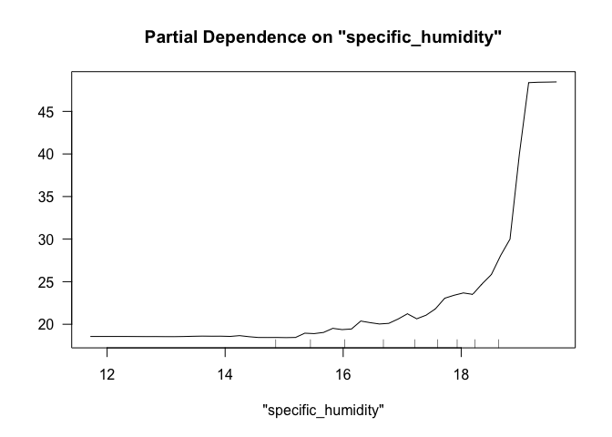
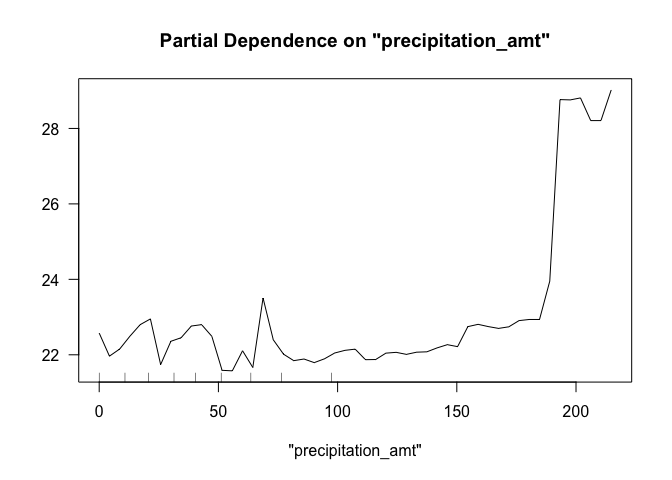
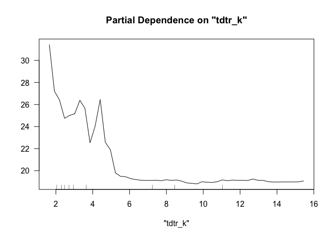
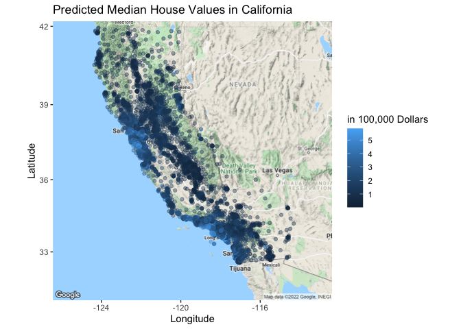
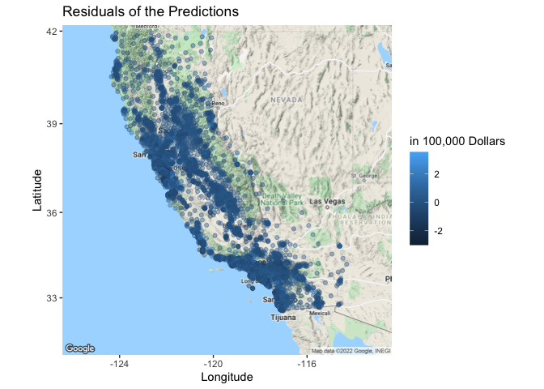

## What causes what?

1.  You can’t just get data from a few different cities and run the
    regressions of “Crime” on “Police” because cities have incentives to
    hire more cops when there is an increased number of crimes. Because
    of this, it would look like “Crime” is positively correlated to
    “Police” when there is no reason to believe there is a causal
    relationship.

2.  The researchers from UPenn were able to isolate this effect because
    the District of Columbia had the policy where they increased
    “Police” when there is an increased risk of terrorism, which is
    believed to be unrelated to the street crime rates. The result in
    the “Table 2” below says that there is a statistically significant
    negative relationship between the “High Alert” and “Crime”, implying
    that the increased number of cops because of the possible terrorist
    risk decreased the crime rates. This holds true even after
    controlling for the ridership of Metro.

3.  They had to control for Metro ridership because, if “Crime”
    decreased because there were less people on the streets, that would
    not neccesarily mean the rate of crime decreasing because of the
    increased number of cops. This would be of concern if people stayed
    home because of the terrorist alert. However, it did not turn out to
    be true. They were trying to capture the effect of the decrease of
    normal human activity in the city on the number of crime incidents.

4.  The model being estimated here is the effect of “High Alert”,
    controlled for “Midday Ridership”, by districts (if it is district 1
    or not). The conclusion is that the effect of “High Alert” is only
    significant in the first police district area.

## Tree modeling: dengue cases

|      |   Tree 1 |  Tree 2 |   Tree 3 |
|:-----|---------:|--------:|---------:|
| RMSE | 28.06073 | 27.8904 | 28.25697 |

First, I split the data into training and testing sets. Then, I wanted
to choose the best CART model. For CART, we choose the second model with
the specification of
`total_cases ~ season + specific_humidity + tdtr_k + precipitation_amt`
as it has the lowest in-sample cross validated rMSE. Then, I trained
again the chosen model with all the training data and pruned the tree.

|      | Random Forest 1 | Random Forest 2 | Random Forest 3 |
|:-----|----------------:|----------------:|----------------:|
| RMSE |        25.64166 |        25.65276 |        26.08037 |

For the random forest model, we choose the third model with the
specification of
`total_cases ~ city + season + specific_humidity + tdtr_k + precipitation_amt`
as it has the lowest in-sample cross validated rMSE. Then, I trained
again the chosen model with all the training data.

|      | Gradient Boosted Tree 1 | Gradient Boosted Tree 2 | Gradient Boosted Tree 3 |
|:-----|------------------------:|------------------------:|------------------------:|
| RMSE |                 26.5814 |                27.49868 |                27.09754 |

For the gradient boosted tree model, we again choose the third model
with the specification of
`total_cases ~ city + season + specific_humidity + tdtr_k + precipitation_amt`
as it has the lowest in-sample cross validated rMSE. Then, I trained
again the chosen model with all the training data.

|      |     CART |   Pruned | Ranbdom Forest |  Boosted |
|:-----|---------:|---------:|---------------:|---------:|
| RMSE | 30.09254 | 32.62713 |       29.34665 | 31.71879 |

Out-of-sample rMSE is lowest with the random forest model. We draw the
partial dependence plots on `specific_humidity`, `precipitation_amt`,
and `tdtr_k` below.

## Predictive model building: green certification

We started modeling with combining the LEED and EnergyStar to create a
green_certified column, which is a dummy variable that is 1 if green
certified in any form and 0 otherwise. Also, we removed the nulls. Then,
we created a train/test split with 80 percent of the data being the
training set data and 20 percent being the testing set data. In the
analysis, we do not use `CS_PropertyID` variable as it is just the
unique id’s for each property.

In terms of the types of models, we started with a baseline linear
regression model, with the specification of revenue on everything else.
After that, using the stepwise variable selection function, we computed
the best set of variables and the interaction between them which
performed the best. The linear model chose by the stepwise function is
`revenue ~ cluster + size + empl_gr +      stories + age + renovated + class_a + class_b + green_rating +      net + amenities + cd_total_07 + hd_total07 + total_dd_07 +      Precipitation + Gas_Costs + Electricity_Costs + City_Market_Rent +      green_certified + size:City_Market_Rent +      size:Precipitation + stories:class_a + size:Gas_Costs + cluster:City_Market_Rent +      green_rating:amenities + cd_total_07:hd_total07 + age:City_Market_Rent +      age:total_dd_07 + renovated:Precipitation + cluster:size +      Electricity_Costs:City_Market_Rent +      renovated:Gas_Costs + :Precipitation + stories:renovated +      age:class_b + hd_total07:total_dd_07 +      size:green_rating + size:class_b + size:class_a + size:age +      age:Electricity_Costs + renovated:City_Market_Rent + renovated:total_dd_07 +      class_a:City_Market_Rent + amenities:Electricity_Costs +      size:renovated + empl_gr:Gas_Costs +      class_a:Gas_Costs +      class_a:hd_total07 + class_a:Electricity_Costs + age:class_a +      class_a:Precipitation + empl_gr:renovated + cluster:Electricity_Costs +      cluster:hd_total07 + size:cd_total_07 + stories:cd_total_07 +      size:Electricity_Costs + age:Gas_Costs + class_b:Gas_Costs +      stories:age + renovated:Electricity_Costs + cd_total_07:total_dd_07 +      age:cd_total_07 + hd_total07:Electricity_Costs + stories:Precipitation +      amenities:Gas_Costs + amenities:Precipitation`.
We decided to take both models to the final decision where we compare
the out-of-sample RMSE’s.

Next, we experimented with a tree model by considering all the variables
except LEED, Energystar because LEED and Energystar is already
considered under the green_certified (tree 3). We then constructed 2
more tree models, one having all the variables and the other one without
leasing_rate, Rent, LEED and Energystar as features (tree 1 and 2). The
specifications are `revenue ~ . - CS_PropertyID`,
`revenue ~ . - LEED - Energystar - leasing_rate - Rent - CS_PropertyID`,
and `revenue ~ . - LEED - Energystar - CS_PropertyID` for each model 1,
2, and 3. We compared the three models with cross validated in-sample
rMSE’s with the fold of 5. The table for the rMSE’s are below. As the
one that takes all the variables into account has the lowest rMSE, we
choose this model to take to the final decision. We then also pruned the
tree to see if this would increase the performance.

|      |   Tree 1 |   Tree 2 |   Tree 3 |
|:-----|---------:|---------:|---------:|
| RMSE | 1388.617 | 1449.236 | 1369.039 |

For random forest models, we also started with three models that utilize
different features as in choosing the tree model. The specifications are
`revenue ~ . - CS_PropertyID`,
`revenue ~ . - LEED - Energystar - leasing_rate - Rent - CS_PropertyID`,
and `revenue ~ . - LEED - Energystar - CS_PropertyID` for each model 1,
2, and 3. Out of the three models, the model which had all the variables
performed the best during cross-validated in-sample performance test.
The table for the rMSE’s for each forest model is below.

|      | Random Forest 1 | Random Forest 2 | Random Forest 3 |
|:-----|----------------:|----------------:|----------------:|
| RMSE |        241.9962 |        776.1325 |        232.3385 |

We repeated the process for gradient boosted models. We used Gradient
Boosting models with distribution as “gaussian”, the number of trees as
10000, shrinkage as 0.01,and with a interaction depth of 4. Out of the
three models, the model which had all the variables performed the best
during cross-validated in-sample performance test. The table for the
rMSE’s for each boosted model is below.

|      | Boosted 1 | Boosted 2 | Boosted 3 |
|:-----|----------:|----------:|----------:|
| RMSE |  284.3986 |  912.2533 |  292.7291 |

We repeat the process for knn models. Out of the same three models, the
model which had all the variables except for
`LEED, Energystar, leasing_rate,` and `Rent` with `k = 5` performed the
best during cross-validated in-sample performance test. The table for
the rMSE’s for each boosted model is below.

|      |   knn 1 |    knn 2 |    knn 3 |
|:-----|--------:|---------:|---------:|
| k    |    5.00 |    5.000 |    5.000 |
| RMSE | 1348.08 | 1329.376 | 1339.207 |

Finally, we chose tree 3 and knn 3 as it has the lowest in-sample
cross-validated RMSE’s. For the random forest and gradient boosted
models, we choose the 3’s although 1’ perform slightly better. This is
because we’re trying to answer the question of the effect of getting the
green certification on the revenue per square foot per calendar year and
including the two variables in the model woud dilute the partial
dependence.

In the end, we trained the chosen models with all the training data and
the out-of sample rmse values. The table for this is below.

|      |   Linear | Stepwise |     Tree | Pruned Tree |   Forest |     GBM |      knn |
|:-----|---------:|---------:|---------:|------------:|---------:|--------:|---------:|
| RMSE | 1089.988 | 1081.185 | 1613.272 |    381.9242 | 259.7799 | 212.712 | 1254.733 |

Since the gradient boosted model performed the best, we calculated the
difference of the predicted revenue for `green_certified == 1` and
`green_certified == 0` to calculate the partial dependence of the green
certification. On average, a green_certified building generates
193.2565864 dollars more in revenue, per square foot per year, compared
to a non green_certified building.

    ## [1] 193.2566

## Predictive model building: California housing

We start by splitting the dataset into training and testing set.
Training set takes 80% of the dataset and rest going to the testing set.
In terms of the model selection, we started with a baseline linear
model. To select the statistically significant variables, we created a
stepwise selection model with all the variables except latitude and
longitude in the scope. After this, we built tree, random forest and
gradient boosted models with
`housingMedianAge, totalRooms, totalBedrooms, population, households, medianIncome`
variables and all the variables including `longitude` and `latitude`. We
also pruned the tree models to check if it produces a better model. It
turned out that pruned tree was not better than the tree model. The
table of in-sample cross-validated RMSE’s for each model is below.

|      | Tree 1 |   Tree 2 |
|:-----|-------:|---------:|
| RMSE | 100562 | 104264.2 |

|      | Random Forest 1 | Random Forest 2 |
|:-----|----------------:|----------------:|
| RMSE |        51569.95 |        65851.06 |

|      | Boosted 1 | Boosted 2 |
|:-----|----------:|----------:|
| RMSE |  52041.46 |  67013.85 |

We compare the out-of-sample RMSE’s of the best tree, random forest, and
gradient boosted models along with the baseline linear model and the
stepwise-selected model.

|      |   Linear | Stepwise |    Tree | Pruned Tree |   Forest |     GBM |
|:-----|---------:|---------:|--------:|------------:|---------:|--------:|
| RMSE | 76308.71 | 73574.85 | 68556.9 |     69647.3 | 52313.02 | 50174.9 |

Therefore, we choose the gradient boosted model that has all the
variables as the features. This makes sense, as the price would be
affected by the location of the house. The plots are below.

