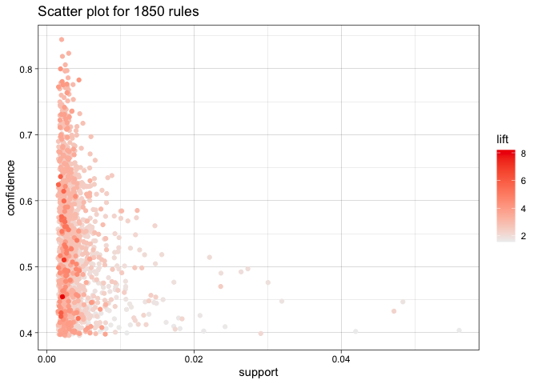
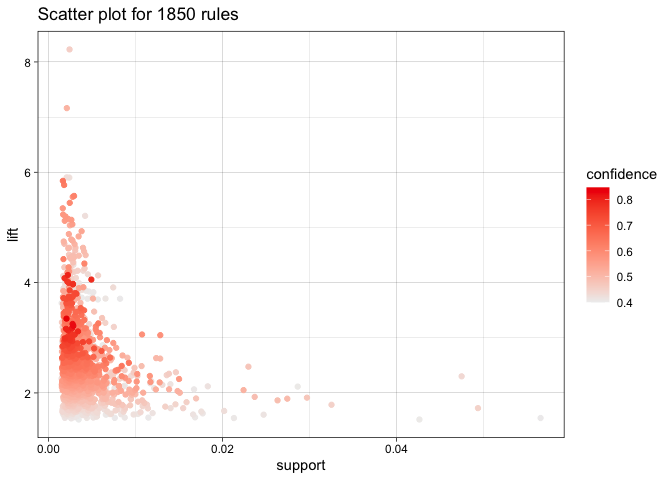
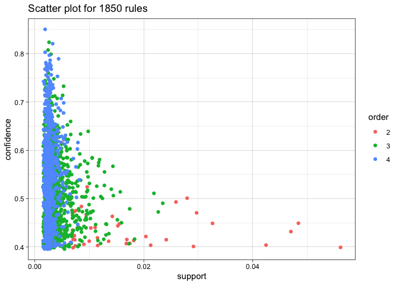
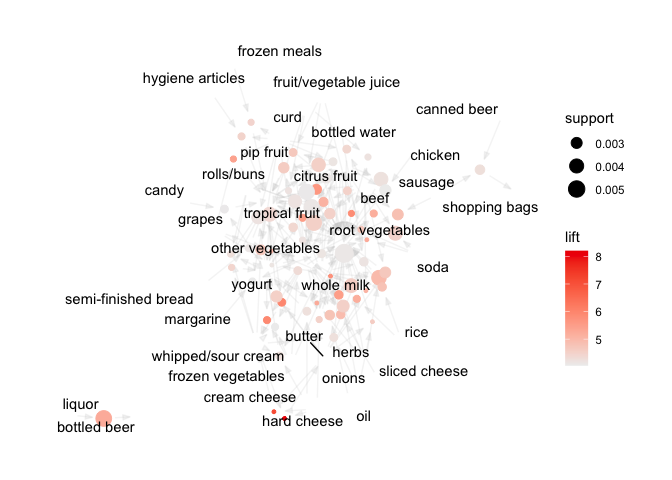
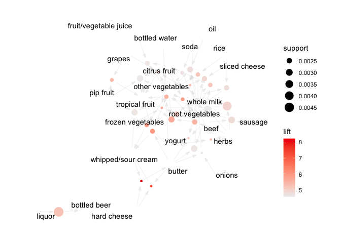

## Clustering and PCA

We first ran PCA on those 11 chemical properties.

From the first graph, we can see that red and white wines sort of form
clusters. This suggests that even after applying PCA, clustering would
be useful. The second graph says that the qualities are kind of all over
places, not easy to find a pattern.

I first picked the model of 2 clusters to see if it would naturally form
two clusters of red and white wines. The first graph represents how the
two clusters are formed with the color and quality, it looks like one
cluster has red wine and the other has white wine, across all qualities.

Next, I picked the model of 4 clusters, hoping to see four groups of
wine, low/high qualities and red/wine. The second graph represents the 4
clusters across different colors and qualities of wine. I can’t really
find a set pattern for the groups I was hoping to find.

I then went ahead to graph the clusters on the PCA axes, having the
shape denote the color/quality. We can see how useful the clusters are
to explain the colors but not so much for the qualities. That is, almost
all points belong to one color of wine in the first graph, whereas there
are many points that are in different clusters with the same quality.

## Market Segmentation

Let’s get some useful information about the market. In this code snippet
we are checking which are the top 5 popular tweet categories.

|                  | Total |
|:-----------------|------:|
| chatter          | 34671 |
| photo_sharing    | 21256 |
| health_nutrition | 20235 |
| cooking          | 15750 |
| politics         | 14098 |
| sports_fandom    | 12564 |

Ignoring chatter since it doesn’t belong to any single category.
`Photo sharing`, `health_nutrition`, `cooking`, `politics`,
`sports_fandom` are the top 4 popular tweet categories in the dataset.

Let’s try to run a standard PCA algoritm on the data.

The standard PCA doesn’t really help in this case because we are not
looking into a specific category of tweet. But grouping them into
clusters along with this graph can show us the categories that are
grouped together.

Let’s do a hierarchical clustering model and see if we can group the
categories together to get a more idea about the broader market
segments.

The cluster dendogram which uses the euclidean distance and the average
distance to group doesn’t give us any information about the marget
segments in general.

Now let’s perform k-means clustering which I think coupled with the PCA
methods will give a meaningful market segments. First step is to find
the optimal value for k that we should use in the `kmeans` method. For
each value of `k`, calculate the `withiness`, `betweeness` and
`CH-Index` from these values. This can help us get the optimal value of
`k`.

We decided to go with `k=3`. I think the improvement stops after `k=3`.

This plot shows how the clusters divide the PCA plot and looks like each
of these graphs have different categories. let’s analyze more on that.
We start by selecting the k-means cluster and grouping them by the
cluster and calculate the sum of the number of tweets. Also remove the
`cluster`, `chatter`, and `uncategorized` as they are not a part of any
specific market segment.

Let’s plot the top 5 categories suggested by each of the clusters used
in k-means.

Each clusters give us interesting results,

-   `Cluster1` - All the top 10 categories shown in the graph share
    similar percentage of the number of tweets between 4-6%. This
    category looks like representative of topics related to or covered
    in traditional mass media.
-   `Cluster2` - `photo_sharing`, `cooking`, `shopping`, and
    `college_uni` are the top 4 categories from this market category. I
    think this is representative of the young adults and college
    students because people generally associate those activities with
    the young adults.
-   `Cluster3` - `health_nutrition`, `personal_fitness` and `cooking`
    form separate market segment. This looks like a separate market
    segment where `health` is important.

We also see a lot of overlaps in the tweet categories between the
different clusters which is expected but `k-means` manages to extract
some useful information about the “market categories” of people using
the `NutrientH20` product. Based on this we suggest that they target
three distinct groups of **General Public / Traditional Mass Media /
Current Politics and News**, **Young Adults / **, and **Personal Fitness
/ Healthy Lifestyles**.

## Association rules for grocery purchase

As the average number of items in groceries list is 4.41, I chose the
`maxlen` to be 4. Also, since there are so many items, I chose a low
support of .002 as the threshold, with confidence equal to .4. With
higher support I did not get many rules. Plus, I thought if someone buys
something after putting another thing in the shopping cart with
probability of 0.4, it’s pretty meaningful. The table below shows the
rules with lift higher than 4 out of all the rules with the parameters I
specified.

    ##      lhs                         rhs                      support confidence    coverage     lift count
    ## [1]  {liquor}                 => {bottled beer}       0.004677173  0.4220183 0.011082867 5.240594    46
    ## [2]  {other vegetables,                                                                                
    ##       rice}                   => {root vegetables}    0.002236909  0.5641026 0.003965430 5.175325    22
    ## [3]  {rice,                                                                                            
    ##       whole milk}             => {root vegetables}    0.002440264  0.5217391 0.004677173 4.786665    24
    ## [4]  {herbs,                                                                                           
    ##       yogurt}                 => {root vegetables}    0.002033554  0.5714286 0.003558719 5.242537    20
    ## [5]  {herbs,                                                                                           
    ##       other vegetables}       => {root vegetables}    0.003863752  0.5000000 0.007727504 4.587220    38
    ## [6]  {herbs,                                                                                           
    ##       whole milk}             => {root vegetables}    0.004168785  0.5394737 0.007727504 4.949369    41
    ## [7]  {other vegetables,                                                                                
    ##       semi-finished bread}    => {tropical fruit}     0.002236909  0.4313725 0.005185562 4.110997    22
    ## [8]  {grapes,                                                                                          
    ##       pip fruit}              => {tropical fruit}     0.002135231  0.5675676 0.003762074 5.408941    21
    ## [9]  {cat food,                                                                                        
    ##       other vegetables}       => {root vegetables}    0.002846975  0.4375000 0.006507372 4.013818    28
    ## [10] {frozen meals,                                                                                    
    ##       pip fruit}              => {tropical fruit}     0.002135231  0.4666667 0.004575496 4.447351    21
    ## [11] {butter,                                                                                          
    ##       hard cheese}            => {whipped/sour cream} 0.002033554  0.5128205 0.003965430 7.154028    20
    ## [12] {hard cheese,                                                                                     
    ##       whipped/sour cream}     => {butter}             0.002033554  0.4545455 0.004473818 8.202669    20
    ## [13] {candy,                                                                                           
    ##       yogurt}                 => {tropical fruit}     0.002338587  0.4259259 0.005490595 4.059091    23
    ## [14] {butter,                                                                                          
    ##       onions}                 => {root vegetables}    0.002033554  0.5000000 0.004067107 4.587220    20
    ## [15] {onions,                                                                                          
    ##       whipped/sour cream}     => {root vegetables}    0.002338587  0.4600000 0.005083884 4.220243    23
    ## [16] {hygiene articles,                                                                                
    ##       pip fruit}              => {tropical fruit}     0.002236909  0.4680851 0.004778851 4.460869    22
    ## [17] {canned beer,                                                                                     
    ##       sausage}                => {shopping bags}      0.002643620  0.4193548 0.006304016 4.256300    26
    ## [18] {chicken,                                                                                         
    ##       citrus fruit}           => {root vegetables}    0.003050330  0.4411765 0.006914082 4.047547    30
    ## [19] {beef,                                                                                            
    ##       curd}                   => {root vegetables}    0.002135231  0.4565217 0.004677173 4.188331    21
    ## [20] {beef,                                                                                            
    ##       butter}                 => {root vegetables}    0.002948653  0.5087719 0.005795628 4.667698    29
    ## [21] {beef,                                                                                            
    ##       fruit/vegetable juice}  => {root vegetables}    0.002236909  0.4400000 0.005083884 4.036754    22
    ## [22] {beef,                                                                                            
    ##       pip fruit}              => {root vegetables}    0.002338587  0.4791667 0.004880529 4.396086    23
    ## [23] {beef,                                                                                            
    ##       citrus fruit}           => {root vegetables}    0.003863752  0.4578313 0.008439248 4.200346    38
    ## [24] {beef,                                                                                            
    ##       sausage}                => {root vegetables}    0.002948653  0.5272727 0.005592272 4.837432    29
    ## [25] {beef,                                                                                            
    ##       tropical fruit}         => {root vegetables}    0.003762074  0.4933333 0.007625826 4.526057    37
    ## [26] {beef,                                                                                            
    ##       soda}                   => {root vegetables}    0.003965430  0.4875000 0.008134215 4.472540    39
    ## [27] {herbs,                                                                                           
    ##       other vegetables,                                                                                
    ##       whole milk}             => {root vegetables}    0.002440264  0.6000000 0.004067107 5.504664    24
    ## [28] {grapes,                                                                                          
    ##       tropical fruit,                                                                                  
    ##       whole milk}             => {other vegetables}   0.002033554  0.8000000 0.002541942 4.134524    20
    ## [29] {grapes,                                                                                          
    ##       other vegetables,                                                                                
    ##       whole milk}             => {tropical fruit}     0.002033554  0.5263158 0.003863752 5.015810    20
    ## [30] {hard cheese,                                                                                     
    ##       other vegetables,                                                                                
    ##       whole milk}             => {root vegetables}    0.002135231  0.4883721 0.004372140 4.480541    21
    ## [31] {root vegetables,                                                                                 
    ##       sliced cheese,                                                                                   
    ##       whole milk}             => {other vegetables}   0.002440264  0.7741935 0.003152008 4.001153    24
    ## [32] {other vegetables,                                                                                
    ##       sliced cheese,                                                                                   
    ##       whole milk}             => {root vegetables}    0.002440264  0.5333333 0.004575496 4.893035    24
    ## [33] {oil,                                                                                             
    ##       other vegetables,                                                                                
    ##       whole milk}             => {root vegetables}    0.002643620  0.5200000 0.005083884 4.770709    26
    ## [34] {onions,                                                                                          
    ##       whipped/sour cream,                                                                              
    ##       whole milk}             => {other vegetables}   0.002135231  0.7777778 0.002745297 4.019677    21
    ## [35] {onions,                                                                                          
    ##       other vegetables,                                                                                
    ##       whole milk}             => {root vegetables}    0.003253686  0.4923077 0.006609049 4.516648    32
    ## [36] {cream cheese ,                                                                                   
    ##       whipped/sour cream,                                                                              
    ##       whole milk}             => {yogurt}             0.002338587  0.5897436 0.003965430 4.227499    23
    ## [37] {cream cheese ,                                                                                   
    ##       root vegetables,                                                                                 
    ##       whole milk}             => {yogurt}             0.002338587  0.5897436 0.003965430 4.227499    23
    ## [38] {frozen vegetables,                                                                               
    ##       other vegetables,                                                                                
    ##       whipped/sour cream}     => {yogurt}             0.002236909  0.5641026 0.003965430 4.043694    22
    ## [39] {frozen vegetables,                                                                               
    ##       other vegetables,                                                                                
    ##       yogurt}                 => {whipped/sour cream} 0.002236909  0.4230769 0.005287239 5.902073    22
    ## [40] {citrus fruit,                                                                                    
    ##       frozen vegetables,                                                                               
    ##       other vegetables}       => {root vegetables}    0.002033554  0.6250000 0.003253686 5.734025    20
    ## [41] {frozen vegetables,                                                                               
    ##       tropical fruit,                                                                                  
    ##       whole milk}             => {root vegetables}    0.002338587  0.4693878 0.004982206 4.306370    23
    ## [42] {beef,                                                                                            
    ##       butter,                                                                                          
    ##       whole milk}             => {root vegetables}    0.002033554  0.5555556 0.003660397 5.096911    20
    ## [43] {beef,                                                                                            
    ##       citrus fruit,                                                                                    
    ##       other vegetables}       => {root vegetables}    0.002135231  0.6363636 0.003355363 5.838280    21
    ## [44] {beef,                                                                                            
    ##       citrus fruit,                                                                                    
    ##       whole milk}             => {root vegetables}    0.002236909  0.5641026 0.003965430 5.175325    22
    ## [45] {beef,                                                                                            
    ##       other vegetables,                                                                                
    ##       tropical fruit}         => {root vegetables}    0.002745297  0.6136364 0.004473818 5.629770    27
    ## [46] {beef,                                                                                            
    ##       tropical fruit,                                                                                  
    ##       whole milk}             => {root vegetables}    0.002541942  0.5555556 0.004575496 5.096911    25
    ## [47] {beef,                                                                                            
    ##       other vegetables,                                                                                
    ##       soda}                   => {root vegetables}    0.002033554  0.5714286 0.003558719 5.242537    20
    ## [48] {beef,                                                                                            
    ##       other vegetables,                                                                                
    ##       yogurt}                 => {root vegetables}    0.002338587  0.4509804 0.005185562 4.137493    23
    ## [49] {beef,                                                                                            
    ##       other vegetables,                                                                                
    ##       rolls/buns}             => {root vegetables}    0.002846975  0.4912281 0.005795628 4.506743    28
    ## [50] {citrus fruit,                                                                                    
    ##       curd,                                                                                            
    ##       whole milk}             => {yogurt}             0.002135231  0.5833333 0.003660397 4.181548    21
    ## [51] {curd,                                                                                            
    ##       tropical fruit,                                                                                  
    ##       whole milk}             => {yogurt}             0.003965430  0.6093750 0.006507372 4.368224    39
    ## [52] {margarine,                                                                                       
    ##       other vegetables,                                                                                
    ##       tropical fruit}         => {yogurt}             0.002236909  0.5641026 0.003965430 4.043694    22
    ## [53] {butter,                                                                                          
    ##       other vegetables,                                                                                
    ##       tropical fruit}         => {whipped/sour cream} 0.002338587  0.4259259 0.005490595 5.941818    23
    ## [54] {bottled water,                                                                                   
    ##       butter,                                                                                          
    ##       whole milk}             => {root vegetables}    0.002440264  0.4528302 0.005388917 4.154464    24
    ## [55] {butter,                                                                                          
    ##       other vegetables,                                                                                
    ##       yogurt}                 => {tropical fruit}     0.003050330  0.4761905 0.006405694 4.538114    30
    ## [56] {citrus fruit,                                                                                    
    ##       fruit/vegetable juice,                                                                           
    ##       other vegetables}       => {tropical fruit}     0.002338587  0.4893617 0.004778851 4.663636    23
    ## [57] {citrus fruit,                                                                                    
    ##       fruit/vegetable juice,                                                                           
    ##       other vegetables}       => {root vegetables}    0.002338587  0.4893617 0.004778851 4.489620    23
    ## [58] {fruit/vegetable juice,                                                                           
    ##       root vegetables,                                                                                 
    ##       tropical fruit}         => {other vegetables}   0.002541942  0.7812500 0.003253686 4.037622    25
    ## [59] {other vegetables,                                                                                
    ##       pip fruit,                                                                                       
    ##       whipped/sour cream}     => {tropical fruit}     0.002745297  0.4909091 0.005592272 4.678383    27
    ## [60] {rolls/buns,                                                                                      
    ##       tropical fruit,                                                                                  
    ##       whipped/sour cream}     => {yogurt}             0.002135231  0.6176471 0.003457041 4.427521    21
    ## [61] {rolls/buns,                                                                                      
    ##       whipped/sour cream,                                                                              
    ##       yogurt}                 => {tropical fruit}     0.002135231  0.4468085 0.004778851 4.258102    21
    ## [62] {citrus fruit,                                                                                    
    ##       other vegetables,                                                                                
    ##       pip fruit}              => {tropical fruit}     0.002846975  0.4827586 0.005897306 4.600708    28
    ## [63] {citrus fruit,                                                                                    
    ##       other vegetables,                                                                                
    ##       pip fruit}              => {root vegetables}    0.002643620  0.4482759 0.005897306 4.112680    26
    ## [64] {citrus fruit,                                                                                    
    ##       pip fruit,                                                                                       
    ##       whole milk}             => {root vegetables}    0.002338587  0.4509804 0.005185562 4.137493    23
    ## [65] {pip fruit,                                                                                       
    ##       root vegetables,                                                                                 
    ##       yogurt}                 => {tropical fruit}     0.002440264  0.4615385 0.005287239 4.398479    24
    ## [66] {other vegetables,                                                                                
    ##       pip fruit,                                                                                       
    ##       yogurt}                 => {tropical fruit}     0.003558719  0.4375000 0.008134215 4.169392    35
    ## [67] {citrus fruit,                                                                                    
    ##       root vegetables,                                                                                 
    ##       yogurt}                 => {tropical fruit}     0.002135231  0.4375000 0.004880529 4.169392    21
    ## [68] {citrus fruit,                                                                                    
    ##       root vegetables,                                                                                 
    ##       tropical fruit}         => {other vegetables}   0.004473818  0.7857143 0.005693950 4.060694    44
    ## [69] {citrus fruit,                                                                                    
    ##       other vegetables,                                                                                
    ##       tropical fruit}         => {root vegetables}    0.004473818  0.4943820 0.009049314 4.535678    44
    ## [70] {citrus fruit,                                                                                    
    ##       other vegetables,                                                                                
    ##       root vegetables}        => {tropical fruit}     0.004473818  0.4313725 0.010371124 4.110997    44
    ## [71] {citrus fruit,                                                                                    
    ##       other vegetables,                                                                                
    ##       soda}                   => {root vegetables}    0.002135231  0.5121951 0.004168785 4.699104    21
    ## [72] {citrus fruit,                                                                                    
    ##       other vegetables,                                                                                
    ##       whole milk}             => {root vegetables}    0.005795628  0.4453125 0.013014743 4.085493    57
    ## [73] {bottled water,                                                                                   
    ##       root vegetables,                                                                                 
    ##       yogurt}                 => {tropical fruit}     0.002236909  0.5789474 0.003863752 5.517391    22
    ## [74] {other vegetables,                                                                                
    ##       rolls/buns,                                                                                      
    ##       tropical fruit}         => {root vegetables}    0.003558719  0.4545455 0.007829181 4.170200    35

\|\| \|\| \|\| \|\|

It’s interesting to see that if a person buys `liquor`, that person is
likely to buy `bottled beer` as well, which makes a lot of sense. There
are many rules with `root vegetables` on the right hand side.

From these three graphs, we can see that the majority of rules have
support less than 0.01. Another interesting fact is that a lot of rules
have the order of three or four. They tend to have lower support as
well, which is probably because it’s not likely to have that specific
combination in a shopping cart.

I then plotted top 70 rules by lift.

    ## Available control parameters (with default values):
    ## layout    =  stress
    ## circular  =  FALSE
    ## ggraphdots    =  NULL
    ## edges     =  <environment>
    ## nodes     =  <environment>
    ## nodetext  =  <environment>
    ## colors    =  c("#EE0000FF", "#EEEEEEFF")
    ## engine    =  ggplot2
    ## max   =  100
    ## verbose   =  FALSE

We can see the highest lift rule of `liquor` → `bottled beer`.
`root vegetables` and `other vegetables` have very big circles.

The graph below shows top 30 rules by lift.

