## Clustering and PCA

We first ran PCA on those 11 chemical properties.

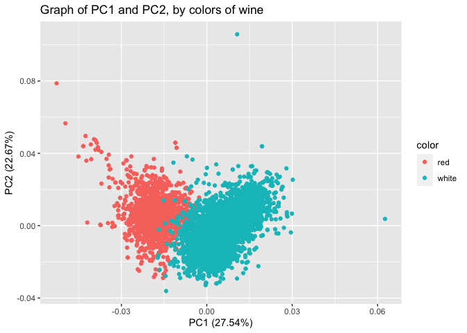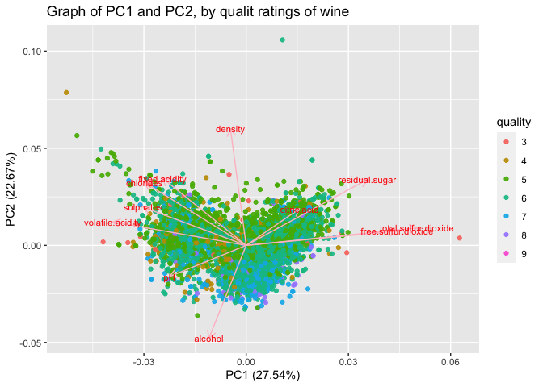

From the first graph, we can see that red and white wines have pretty
different principal components. That is, we can easily distinguish

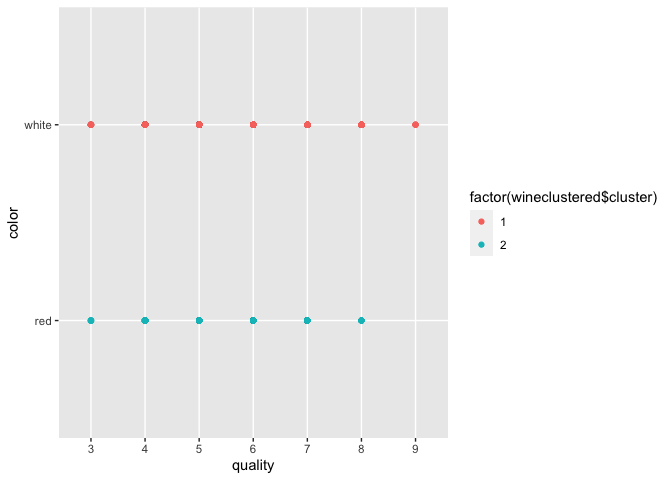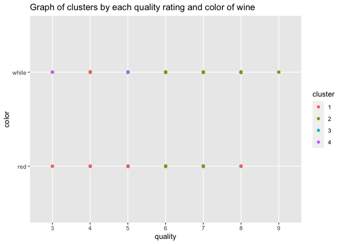

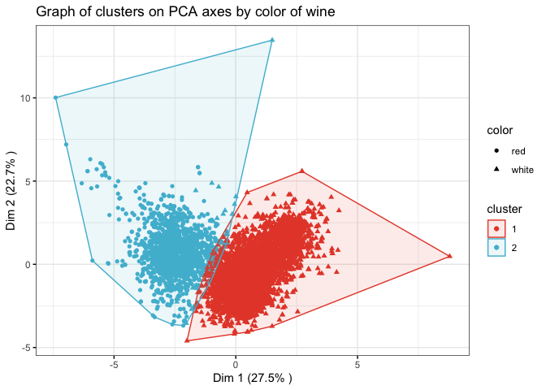

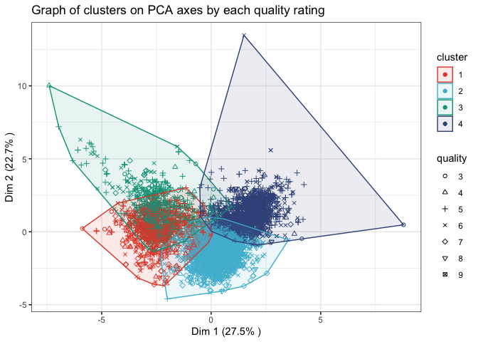

## Market Segmentation

    ##                  Total
    ## chatter          34671
    ## photo_sharing    21256
    ## health_nutrition 20235
    ## cooking          15750
    ## politics         14098
    ## sports_fandom    12564

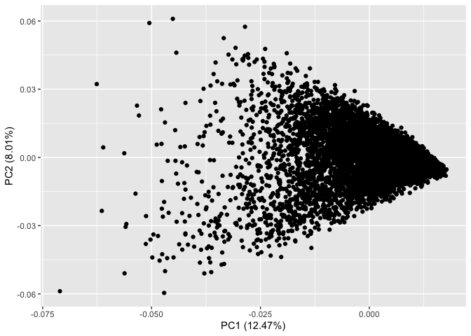

    ## Importance of first k=3 (out of 36) components:
    ##                           PC1     PC2     PC3
    ## Standard deviation     2.1186 1.69824 1.59388
    ## Proportion of Variance 0.1247 0.08011 0.07057
    ## Cumulative Proportion  0.1247 0.20479 0.27536

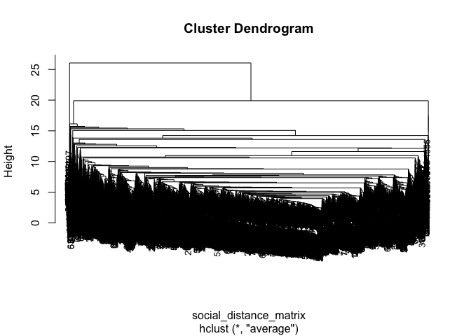

    ##    1    2 
    ## 7880    2

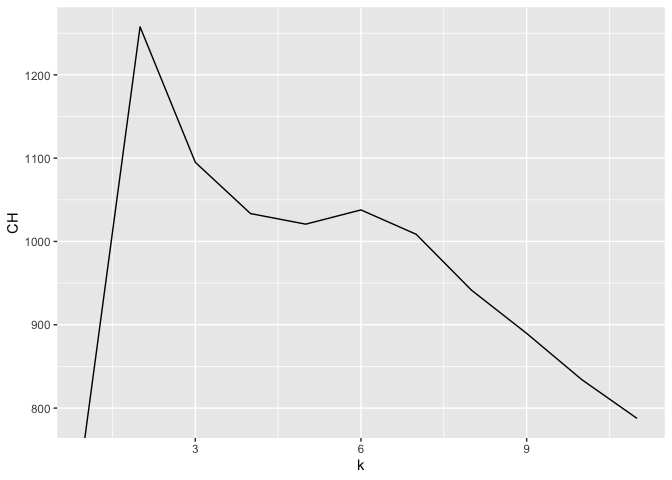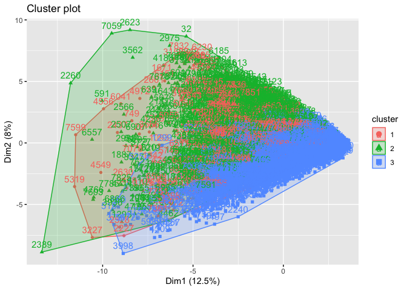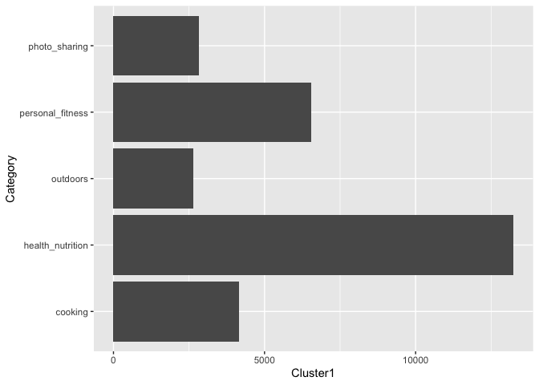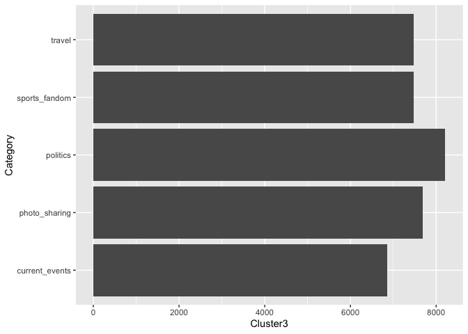

## Association rules for grocery purchase

    ## Apriori
    ## 
    ## Parameter specification:
    ##  confidence minval smax arem  aval originalSupport maxtime support minlen
    ##         0.1    0.1    1 none FALSE            TRUE       5    0.01      1
    ##  maxlen target  ext
    ##       2  rules TRUE
    ## 
    ## Algorithmic control:
    ##  filter tree heap memopt load sort verbose
    ##     0.1 TRUE TRUE  FALSE TRUE    2    TRUE
    ## 
    ## Absolute minimum support count: 98 
    ## 
    ## set item appearances ...[0 item(s)] done [0.00s].
    ## set transactions ...[169 item(s), 9835 transaction(s)] done [0.00s].
    ## sorting and recoding items ... [88 item(s)] done [0.00s].
    ## creating transaction tree ... done [0.00s].
    ## checking subsets of size 1 2 done [0.00s].
    ## writing ... [339 rule(s)] done [0.00s].
    ## creating S4 object  ... done [0.00s].

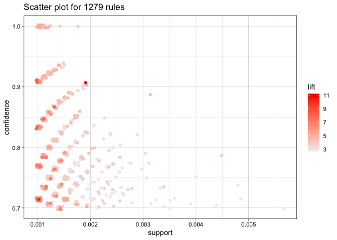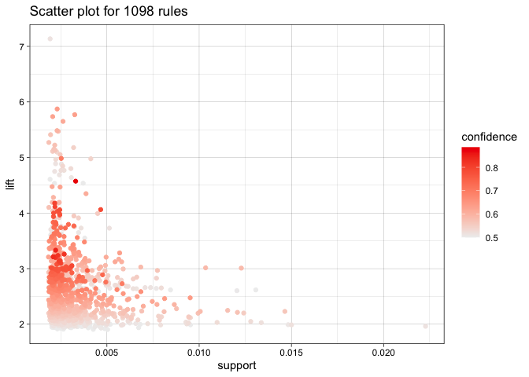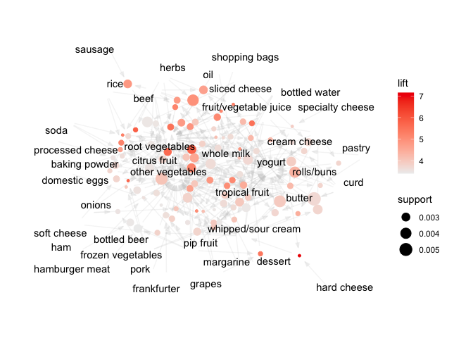

Chose the confidence and the support cutoff levels so that the subset
have around 25 rows.
