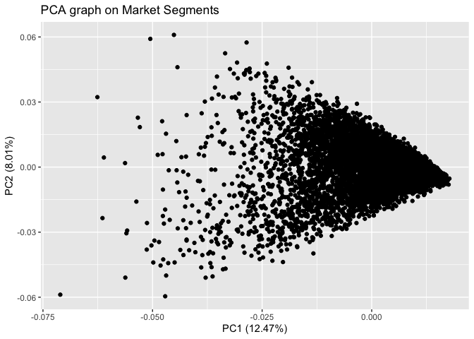
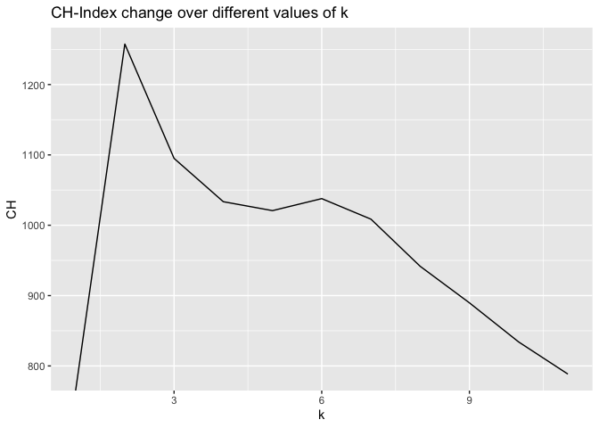
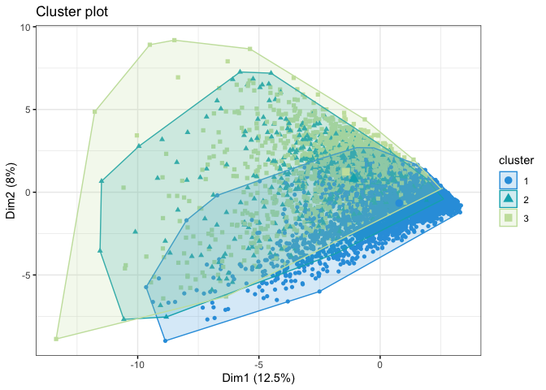
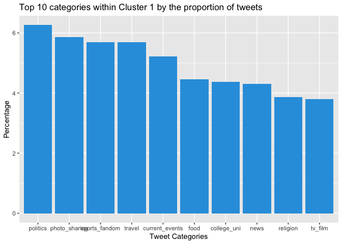
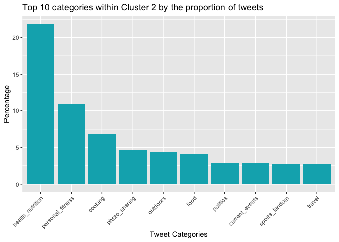

## Clustering and PCA

We first ran PCA on those 11 chemical properties.

From the first graph, we can see that red and white wines sort of form
clusters. This suggests that even after applying PCA, clustering would
be useful. The second graph says that the qualities are kind of all over
places, not easy to find a pattern.

I first picked the model of 2 clusters to see if it would naturally form
two clusters of red and white wines. The first graph represents how the
two clusters are formed with the color and quality, it looks like one
cluster has red wine and the other has white wine, across all qualities.

Next, I picked the model of 4 clusters, hoping to see four groups of
wine, low/high qualities and red/wine. The second graph represents the 4
clusters across different colors and qualities of wine. I can’t really
find a set pattern for the groups I was hoping to find.

I then went ahead to graph the clusters on the PCA axes, having the
shape denote the color/quality. We can see how useful the clusters are
to explain the colors but not so much for the qualities. That is, almost
all points belong to one color of wine in the first graph, whereas there
are many points that are in different clusters with the same quality.

## Market Segmentation

Importing the data

Let’s get some useful information about the market. In this code snippet
we are checking which are the top 5 popular tweet categories.

|                  | Total |
|:-----------------|------:|
| chatter          | 34671 |
| photo_sharing    | 21256 |
| health_nutrition | 20235 |
| cooking          | 15750 |
| politics         | 14098 |
| sports_fandom    | 12564 |

Ignoring chatter sinxe it doesn’t belong to any single category.
`Photo sharing`, `health_nutrition`, `cooking`, `politics`,
`sports_fandom` are the top 4 popular tweet categories in the dataset.

Let’s try to run a standard PCA algoritm on the data
 standard PCA
doesn’t really help in this case because we are not looking into a
specific category of tweet. But grouping them into clusters along with
this graph can show us the categories that are grouped together.

Let’s do a hierarchical clustering model and see if we can group the
categories together to get a more idea about the broader market
segments. 
The cluster dendogram which uses the euclidean distance and the average
distance to group doesn’t give us any information about the marget
segments in general.

Now let’s perform k-means cluster which I think coupled with the PCA
methods will give a meaningful market segments. First step is to find
the optimal value for k that we should use in the `kmeans` method. For
each value of `k`, calculate the `withiness`, `betweeness` and
`CH-Index` from these values. This can help us get the optimal value of
`k`. 
We decided to go with `k=3`. I think the improvement stops after `k=3`.

 This
plot shows how the clusters divide the PCA plot and looks like each of
these graphs have different categories. let’s analyze more on that. We
start by selecting the k-means cluster and grouping them by the cluster
and calculate the sum of the number of tweets. Also remove the
`cluster`, `chatter`, and `uncategorized` as they are not a part of any
specific market segment.

Let’s plot the top 5 categories suggested by each of the clusters used
in k-means.

    ##         Category Cluster1 Cluster2 Cluster3
    ## 6       politics     8214     1735     4149
    ## 3  photo_sharing     7690     2831    10735
    ## 2         travel     7473     1645     3375
    ## 5  sports_fandom     7473     1661     3430
    ## 1 current_events     6851     1694     3485
    ## 7           food     5846     2489     2680

Each clusters give us interesting results,

-   `Cluster1` - All the top 10 categories shown in the graph share
    similar percentage of the number of tweets between 4-6%. This
    category is representative of majority of the population.
-   `Cluster2` - `photo_sharing`, `cooking`, `shopping`, and
    `college_uni`, the top 4 categories form a market category. I think
    this is representative of the young and college students.
-   `Cluster3` - `health_nutrition`, `personal_fitness` and `cooking`
    forms separate market segement. This is a separate `health` market
    segment.

We also see a lot of overlaps in the tweet categories between the
different clusters which is expected but `k-means` manages to extract
some useful information about the `market categories` of people using
the `NutrientH20` product. Based on this we suggest that they target
`college_students`, `younger audience` and people into
`personal_fitness` and `healthy living`.

## Association rules for grocery purchase

Chose the confidence and the support cutoff levels so that the subset
have around 25 rows.
